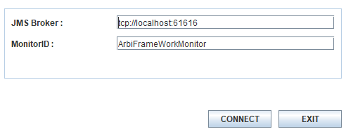
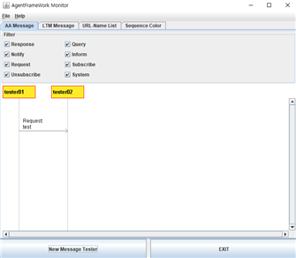
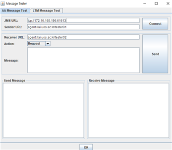

ARBI(Artificial Robot Brain Intelligence) 프레임워크
==============


# 개요
ARBI 프레임워크는 로봇의 지능적 기능 컴포넌트에 대한 통합을 지원하는 에이전트 기반 통신 지원 체계이다.

로봇이 지능적으로 의사결정을 수행하고 작업 계획을 수립하기 위해서는 작업 계획을 수립하는 기능이나 환경정보를 수집하고 가공하는 기능, 나아가 외부와 연계하기 위한 인터페이스 모듈 등 각각의 기능이 독립적으로 구성되어 독자적인 라이프사이클을 가지는 것이 유리하다. 또한 지능적 의사결정을 위한 추론, 작업계획 수립 등의 과정을 위하여 지식정보를 활용하여 데이터를 기술하는 어휘나 관계를 설정하는 방법에 있어 JSON 이나 XML과 같은 일반적인 언어로는 표현력에 한계가 있어 별도의 프로토콜을 활용하여야 한다.

ARBI 프레임워크는 지능 컴포넌트의 독자적인 라이프사이클을 보장하고 지식정보를 기반으로 Event-Driven 모델을 보장할 수 있는 ArbiAgent 인터페이스를 제공한다. 또한 BDI 아키텍처 기반 작업 계획 수립과 추론을 수행하기에 최적화 할 수 있도록 로봇과 주변 센서를 통해 수집한 데이터나 자체적인 추론의 결과 만들어진 상황정보를 저장하고 이벤트를 생성하기 위한 인터페이스를 지닌 LTM(Long Term Memory)을 포함하고 있다.

## 시스템 요구사항 및 설치 

* Hardware : 280MB의 저장 용량
* Enviornment : 리눅스 환경, JRE 1.8 버전, Redis 5.0

### ARBI Framework 설치

- https://github.com/KIST-vision/ARBI-public/tree/master/ArbiFramework 에 접속하여 ArbiFramework 다운로드
      - 다운로드 받은 압축 파일을 해제.

### JRE 설치

 -https://java.com/ko/download 참고

### REDIS 설치

 -https://redis.io/download 참고

### Server Configuration 설정

압축 해제된 폴더 안의 configuration/ServerConfiguration.xml 파일 설정을 통해 Server의 정보 입력

   * MessageBrokerProperty : 사용하는 메시지 브로커가 동작하고 있는 주소와 포트
   * MessageBrokerType : 사용하는 메시지 브로커의 종류(ZeroMQ, 또는 Apollo 중 하나 선택)
   * ARBIFrameworkMonitorStart : 프레임워크에서 기본 제공하는 GUI 모니터의 활성화 여부
   * InteractionManagerStart : 외부 모니터와의 통신 기능을 활성화할지의 여부

   * InteractionManagerBrokerProperty : 외부 모니터와의 통신을 담당할 브로커에 대한 정보(다수의 브로커 활성화 가능)
      * StompBroker : ActiveMQ STOMP 프로토콜을 사용하는 브로커.
      * ApolloBroker : ActiveMQ Apollo 프로토콜을 사용하는 브로커.
      * ZeroMQBroker : ZeroMQ 프로토콜을 사용하는 브로커.
      * SocketBroker : 소켓 통신을 사용하는 브로커.

Configuration 예시
```
<?xml version="1.0"?>
<ARBIFrameworkServerConfiguration>
      <MessageBrokerType>apollo</MessageBrokerType>
      <MessageBrokerProperty>
            <Host>172.16.165.196</Host>
            <Port>61616</Port>
      </MessageBrokerProperty>
      <InteractionManagerStart>true</InteractionManagerStart>
      <InteractionManagerBrokerProperty>
            <StompBroker Available = "false">
                  <Host>172.16.165.196</Host>
                  <Port>61612</Port>
            </StompBroker>
            <ApolloBroker Available = "true">
                  <Host>172.16.165.196</Host>
                  <Port>61611</Port>
            </ApolloBroker>
            <ZeroMQBroker Available = "true">
                  <Host>172.16.165.196</Host>
                  <Port>61613</Port>
            </ZeroMQBroker>
            <SocketBroker Available = "false">
                  <Host>172.16.165.196</Host>
                  <Port>61614</Port>
            </SocketBroker>
      </InteractionManagerBrokerProperty>
<ARBIFrameworkMonitorStart>false</ARBIFrameworkMonitorStart>
</ARBIFrameworkServerConfiguration>
```

# GL(Generalized List)
각각의 Agent들이 상호 통신하는 데에 있어 약속된 프로토콜을 일관되게 사용하기 위해서는 지식기반 통신 언어가 필수적이다. GL은 Nested 표현을 지원하는 Predicate 표현 방법의 한가지로, 지식을 간단하면서도 수준 높은 표현력을 제공하는 특징을 가진다. 또한 프레임워크는 라이브러리를 통해 쉽게 데이터를 조작할 수 있도록 기능을 제공한다.

## 구성 요소
   * expression : GL을 구성하는 표현식. 
   
   * value: Expression에서 사용하는 값. ___Value로 서술 가능한 값과 그 예시는 다음 표와 같다.___

|종류|설명|예시
|---|-------|---|
|String|문자열을 표현하기 위한 Value Type문자 양쪽에 ""를 붙여 표시|"StringTest"|
|Int|정수를 표현하기 위한 Value TypeTrue 및 False를 나타내는데도 사용1은 true, 0은 false|5|
|Float|부동 소수점을 표현하기 위한 Value Type|3.2|
|Variable|변수를 표현하기 위한 Value Type 문자 앞에 $를 붙여 표시|$testVariable

   * function : 서술된 Value들을 이용하여 특정 계산을 수행할 수 있는 Expression. ___Function Expression은 괄호 앞에 #을 붙여 표현한다.___

|종류|설명|예시
|---|-------|---|
|add|더하기를 표현하기 위한 Function|#(add 1 2)|
|sub|빼기를 표현하기 위한 Function|#(sub 2 1)|
|mul|곱하기를 표현하기 위한 Function|#(mul 2 1)|
|div|나누기를 표현하기 위한 Function|#(div 2 1)|
|mod|나머지 연산을 표현하기 위한 Function|#(mod 2 1)|
|gt|첫 번째 Expression이 두 번째 Expression보다 큰지(Greather Than) 비교하기 위한 Function|#(gt 2 1)|
|ge|첫 번째 Expression이 두 번째 Expression보다 크거나 같은지(Grater than or Equal) 비교하기 위한 Function|#(ge 2 1)|
|lt|첫 번째 Expression이 두 번째 Expression보다 작은지(Less Than) 비교하기 위한 Function|#(lt 1 2)|
|le|첫 번째 Expression이 두 번째 Expression보다 작거나 같은지(Less than or Equal) 비교하기 위한 Function|#(lt 1 2)|
|eq|첫 번째 Expression과 두 번째 Expression이 같은지(Equal) 비교하기 위한 Function |#(eq 1 1)|
|ne|첫 번째 Expression과 두 번째 Expression이 다른지(Not Equal) 비교하기 위한 Function |#(eq 1 1)|
|and|두 Expression을 AND 연산하기 위한 Function | #(and 1 1) |
|or|두 Expression을 OR 연산하기 위한 Function | #(or 1 0) |
|not| 해당 Expression의 Not값을 연산하기 위한 Function | #(not $x)|
|test| 해당 Expression의 boolean 값을 연산하기 위한 Function | #(test $x)|

## 예시
### GL문 생성 예시

```
String exp = "(test (testExpression 2 \“test\”))";
GeneralizedList gl = GLFactory.newGLFromGLString(exp);
```

* ~~fTest -> exp~~

### GL문 탐색 방법

```
String glString= "(test (testExpression \“test\”))";
GeneralizedList testGL = GLFactory.newGLFromGLString(glString);
Expression subExp = testGL.getExpression(0);
System.out.println(subExp.toString());
GeneralizedList subGL = subExp.asGeneralizedList();
Expression valueExp = subExp.getExpression(0);
System.out.println(valueExp.toString());

결과 : (testExpression \“test\”)	\“test\“
```

### Unify(변수 Binding) 예시
```
String expLefthand = "(test (testExpression $arg1 $arg2))";
String expRighthand = “(test (testExpression \”a\“ 2))”;
GeneralizedList glLefthand = GLFactory.newGLFromGLString(expLefthand);
GeneralizedList glRighthand   = GLFactory.newGLFromGLString(expRighthand);

Binding b = glLefthand.unify(glRighthand,null);
System.out.println(b.toString());


결과 : {arg1 = ”a“, $arg2 = 2}
```

# ARBIAgent 인터페이스
ArbiAgent 인터페이스는 각각의 지능 컴포넌트가 독자적인 라이프사이클을 보장하기 위하여 비동기 메시지 기반 통신을 지원하는 인터페이스이다. ArbiAgent의 인터페이스는 지식기반 프로토콜을 지원하기 위해서 Multi-Agent 시스템의 표준단체인 FIPA의 Communication 표준을 바탕으로 지능 컴포넌트로서 필수적인 부분을 일부 준용하여 구성되어 있다. ArbiAgent의 인터페이스는 다음과 같다.

## Agent 생성 예시
Agent는 타 에이전트와의 인터페이스를 담당하는 Class에 ArbiAgent를 상속받게 하여 구현한다.   
```
public class AgentTest extends ArbiAgent{
   public AgentTest(){
      ArbiAgentExecutor.execute("tcp://localhost:61616","testAgent1",Broker.ZEROMQ);
      }
   }
   public void onStart(){
      System.out.println(“Agent started!”);
   }
}
```

* ArbiAgentExecutor.execute($brokerAddress, $agentName,$brokerType)
   * Agent를 이미 켜져있는 Broker에 연결하여 통신할 수 있도록 하는 메소드
      - $brokerAddress : 연결할 Broker의 IP 주소
      - $agentName : 다른 에이전트와 메시지를 주고받을 때의 에이전트 식별자
      - $brokerType : 연결할 broker의 종류. ZeroMQ, Apollo, ActiveMQ의 세 종류가 존재한다.
* ArbiAgent.onStart()
   - Agent가 Broker에 접속되었을 때 실행되는 메소드.
* ArbiAgent.onStop()
   - Agent가 Broker와 통신을 종료할 때 실행되는 메소드.

## Interface
모든 인터페이스는   다음 두 인자를 사용한다.
* $agentAddress : 메시지를 송신하는 Agent의 이름
* $data : 실제 메시지의 내용

### Send
다른 Agent에게 단순 메시지를 전달하는 프로토콜.

* 송신 예시
```
this.send("testAgent1", "(testGL \"testContent\")")
```
* 수신 예시
```
public void onData(String sender, String data){
	handleTestData(data);	
}
```

### Request
다른 Agent에게 완료까지 시간이 걸리는 요청을 전달하는 프로토콜. 일반적으로 수행할 수 있는지에 대한 결과만 전달하고 해당 행위에 대한 처리가 완료된 후에 send를 통해 수행 결과를 전달하게 된다.
* 송신 예시
```
this.request("testAgent1", "(testGL \"testContent\")")
```
* 수신 예시
```
public void onRequest(String sender, String data){
	handleTestData(data);	
}
```

### Send
다른 Agent에게 즉시 Response 가능한 새로운 요청을 전달하는 프로토콜. 실행 결과 해당 요청의 Response가 반환된다.

* 송신 예시
```
String queryResult = this.query("testAgent1", "(testGL \"testContent\")")
```
* 수신 예시
```
public String onQuery(String sender, String data){
	String handleResult = handleTestData(data);	
   return handleResult;
}
```

### Subscribe / Unsubscribe
특정 조건을 만족하였을 때 지정한 형식의 메시지를 발송하도록 요청하는 프로토콜. 기본적으로 Subscribe/unsubscribe 하는데 있어 형식은 없으나, 일반적으로 LTM에서 사용하는 형식을 따른다. 
* 송신 예시
```
String subscriptionID = this.subscribe("testAgent1", "(rule (fact (test $a)) --> (notify (testResult $a)))")
```
* 수신 예시
```
public String onSubscribe(String sender, String data){
	String subscriptionID = handleTestSubscription(sender,data);
	return subscriptionID;
}
```

# LTM(Long Term Memory)
로봇이 지능적인 의사결정을 수행하기 위해서는 각각의 기능 컴포넌트가 상호간에 데이터를 교환하는 것 보다 환경에 대한 정보와 이를 통해 추론한 상황 정보 등이 통합적으로 관리하는 것이 효율적이다. 하지만 통합된 데이터 저장소를 직접적으로 polling 하는 것은 추가적인 병목을 볼러올 수 있는데, LTM은 이를 위해 subscribe/notification 프로토콜을 지원하여 특정룰을 만족하는 이벤트를 에이전트가 원하는 형태의 메시지로 가공하여 비동기적으로 제공할 수 있는 방법을 제공한다. 나아가 지속적으로 제공될 필요가 있는 Streaming 등의 방법을 제공하여 실시간으로 인식된 환경에 대해 반응하거나 새로운 상황에 대한 추론을 가능하도록 하고 있다.


LTM은 로봇이 실시간으로 데이터를 저장, 가공하면서 동시에 불시의 오류 등에 대해 데이터를 보존하기 위하여 In-Memory 데이터베이스인 Redis를 활용하고 있다. Redis에 대한 자세한 정보는 다음의 링크를 통해 확인할 수 있다.(https://redis.io/) LTM은 데이터를 교환하기 위한 인터페이스로서 DataSource 인터페이스를 제공하고 있다.

## LTM 접속 예시
```
public class TestDataSource extends DataSource{
   public TestDataSource(){
      this.connect(“tcp://localhost:61616”,“testDataSource”,Broker.ZEROMQ);
      }
   }
   public void onNotify(String content){
      
   }
}
```

* DataSource.connect($brokerURL, $dataSourceName, $brokerType)
   * DataSource를 이미 켜져있는 Broker에 연결하여 LTM과 통신할 수 있도록 하는 메소드.
      * $brokerURL : 연결할 Broker의 주소
      * $dataSourceName : 해당 DataSource의 식별자
      * $brokerType : 연결할 Broker의 종류. ZeroMQ, Apollo, ActiveMQ의 3종류가 존재한다.
* DataSource.onNotify($content)
   * Subscribe한 지식이 LTM에 올라왔을 때 호출되는 메소드. 오버라이드하여 사용한다.
   
* LTM Interface
   * assertFact($gl) : LTM에 GL을 등록하는 프로토콜.
   ```
   dataSource.assertFact(“(test 1)”);
   ```
   * retractFact($gl) : LTM에 등록된 GL을 제거하는 프로토콜. 같은 형식의 GL문이 여러 개 존재할 경우 처음 발견된 하나만 제거된다. 해당하는 GL이 존재하지 않을 경우 (fail)이 반환된다.
   ```
   dataSource.retractFact(“(test $a)”);
   ```
   * updateFact($gl) : LTM에 등록된 GL을 제거하고 새 GL을 Assert하는 프로토콜. Nested된 GL을 사용하며, 첫 번째 Expression의 내용을 두 번째 Expression으로 교체한다.
   ```
   dataSource.assertFact(“(testA 1)”);
   dataSource.updateFact(“(updateTest (testA $a) (testB 4)”);
   ```
   * match($gl) : LTM에 등록된 GL문을 바인딩하여 그 결과를 리턴하는 프로토콜
   ```
   dataSource.assertFact(“(test 1)”);String result = dataSource.match(“(test $a)”);
   System.out.println(result);

   결과 : (bind ($a “1”))
   ```
   * subscribe($subscriptionGL) : LTM에 GL이 Assert, Update될 때 자신이 원하는 형식의 GL이 올라올 경우 onNotify로 전달해주는 프로토콜. (rule (fact $a) --> (notify ($b))의 형태로 Rule을 만들어 등록한다. ___메소드 실행 결과로 Subscription ID가 반환된다.___
   ```
   public void subscribeTest(){
      String subID = dataSource.subscribe(“(rule (fact (test $a)) --> (notify (testResult $a)))”);
      System.out.println(subID);
      dataSource.assertFact(“(test 1)“);
   }

   @Override
   public void onNotify(String content){
      System.out.println(content);
   }

   결과 : 
   Subscribe:372356200691800
   (testResult 1)
   ```

   * unsubscribe($subscriptionID) : Subscribe를 해제하여 주는 프로토콜.
   ```
   String subID = dataSource.subscribe(“(rule (fact (test $a)) --> (notify (testResult $a)))”);
   System.out.println(subID);
   dataSource.unsubscribe(subID);

   결과 : Subscribe:372356200691800
   ```

# InteractionManager

ARBI Framework는 에이전트 기반으로 서로 통신하고 있으며, 이러한 에이전트들을 모니터링하고 제어하기 위해서는 에이전트의 액션 단위의 모니터링 기능이 필요하다.   InteractionManager는 이를 위해서 만들어진 에이전트로, 각 에이전트들로부터 액션에 대한 로그를 수집하고 이를 필터링하여 외부 모니터에 전달하는 역할을 수행한다. InteractionManager는 ZeroMQ 브로커를 통한 통신 이외에도 ActiveMQ, Socket을 통한 통신을 제공하며, 이에 대한 설정은 configuration.xml 파일에서 수정 가능하다.

## Monitor Proxy
monitor proxy는 InteractionManager에서 외부 모니터와 연결하기 위한 proxy이다. 각 proxy에서는 필요한 메시지를 받기 위한 필터가 존재하며, interactionManager와의 프로토콜을 통해 프록시를 생성, 제거하거나 필터를 켜고 끌 수 있다. 

### Monitor Proxy Action

* CreateMonitor :   외부 모니터와 통신하기 위한 프록시를 생성.
	* $Action : 해당 Action의 이름
	* $Flag : 해당 Flag가 켜져있는지의 여부
   ```
   {"Action":"Create Monitor","Filter":{"Action":"AgentMessageResponse", "Flag":"true"},"ID":"ArbiFrameWorkMonitor","Protocol":"ZeroMQ"}
   ```
* ChangeFilter : 외부 모니터에 전달하기 위한 필터를 수정
```
{"Action":"Change Filter","Filter":{"Action":"Response","Flag":"false"},"ID":"ArbiFrameWorkMonitor"}
```
* DeleteMonitor : 외부 모니터와 통신하기 위한 프록시를 제거
```
{"Action":"Delete Monitor","ID":"ArbiFrameWorkMonitor"}
```

## Logger Manager
 에이전트들의 상태를 모니터링하기 위해선 각 에이전트에서 행하는 액션들에 대한 로그를 수집할 수 있어야 한다. LoggerManager는 에이전트가 액션을 수행할 때 로그를 송신할 수 있도록 인터페이스를 제공한다. 

### 관련 클래스 및 메소드

1. LoggerManager : 로그를 관리하기 위한 클래스로 싱글턴 패턴으로 정의된 Instance를 받아와 사용할 수 있다.
   - getInstance() : LoggerManager 인스턴스를 받아오기 위한 메소드. LoggerManager 객체가 반환된다.
   - registerAction(AgentAction action, LogTiming timing) : 특정 Agent Action을 등록하여 LoggerManager를 통해 로그를 전달할 수 있도록 한다.
      * $action : 등록할 Agent Action 객체
      * $timing : 액션이 실행될 때 로그를 보내게 되는 타이밍(LogTiming 항목 참조)
   - getAction(String actionName) : loggerManager에 등록된 액션을 받아 오는 메소드. AgentAction 객체가 반환된다.
      * $action : 받아올 Action의 이름
1. ActionBody : 실제 수행하는 Action을 구현하기 위한 인터페이스.
    - execute(Object o)
       * $o : 실행할 때의 전달인자. 일반적으로 해당 전달 인자의 toString() 실행값을 로그로 송신한다.
1. AgentAction : Log의 Action을 관리하기 위한 클래스. 해당 클래스를 실행함으로써 로그를 송신하는 동시에 액션을 수행할 수 있다.
    - AgentAction(String actionName, ActionBody body)
       * $actionName : 등록할 Action의 이름
       * $body : 등록할 Action의 실제 수행 부분
    - execute(Object o)
       * $o : 실행할 때의 전달인자. 일반적으로 해당 전달인자의 toString() 실행값을 로그로 송신한다.
1. LogTiming : 액션을 수행할 때 로그를 어떤 타이밍에 보내는지 결정하기 위한 Enum 인자
    - Prior : 액션을 실행하기 전 전달인자의 toString 값을 송신
    - Later : 액션을 실행한 후 Return된 값을 송신
    - Both : Prior와 Later를 모두 실행
    - NonAction : 액션을 수행하지 않고 전달인자의 toString값을 송신

### 실행 예시
1. ActionBody를 상속받아 액션 클래스 생성
   ```
   public class TestLogger implements ActionBody{
      @Override
      public Object execute(Object o) {
         //execute action
         return “result”;
      }
   }
   ```
1. AgentAction 생성 및 등록
   ```
   LoggerManager loggerManager = LoggerManager.getInstance();	
   AgentAction testAction = new AgentAction("TestLog",new TestLogger());
   loggerManager.registerAction(testAction,LogTiming.NonAction);
   ```
1. 인자 생성 및 액션 실행
   ```
   LoggerManager loggerManager = LoggerManager.getInstance();
   AgentAction testAction = loggerManager.getAction(“TestLog”);

   TestArgument testArg = new TestArgument(“test”);
   testAction.execute(testArg);
   ```

   ```
   public class TestArgument{
      private String name;
      public RelationArgument(String name){
         this.name = name;
      }
      public String toString(){
         return name;
      }
   }
   ```
# Arbi Monitor

ArbiMonitor는 위의 InteractionManager에 연결할 수 있는 프레임워크가 기본 제공하는 모니터로, 에이전트 간의 메시지 전송과 LTM이 교환하는 메시지를 시각화하여 보여줄 뿐만 아니라, 다른 에이전트에 메시지를 송/수신할 수 있는 더미 에이전트를 제공할 수 있다.

## 실행화면

1. 초기 화면

   
   * $JMS Broker : Interaction Manager에서 제공하는 Broker의 IP 주소. ArbiFramework의 브로커 주소가 아닌 InteractionManager의 브로커 주소를 사용하여야 한다.
   * $MonitorID : 메시지에서 표시되는 Monitor의 Id
1. 에이전트 통신 화면

   
1. Message Tester 화면

   
   * Message Tester를 통해 가상의 에이전트를 생성, 메시지를 송수신하는것이 가능하다.
   * $JMS Broker : 에이전트를 등록할 ArbiFramework의 Broker 주소
   * $Sender URL : 생성할 더미 에이전트의 식별자
   * $Receiver URL : 메시지를 전송할 대상 Agent의 식별자
   * $Action : 사용할 Agent Action의 종류.
   * $Message : 전송할 메시지.
   * Send Message : 지금까지 전송한 메시지 목록.
   * Receive Message : 해당 더미 에이전트가 송신한 메시지 목록.