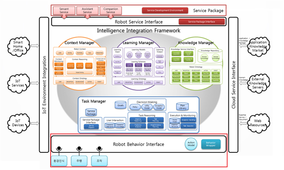
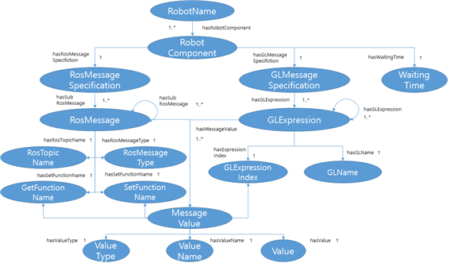

Behavior Interface
===========



# 목차
0. [개요](#개요)
1. [기능](#기능)
2. [시스템 요구사항](#시스템-요구사항)
3. [설치](#설치)
4. [실행법](#실행법)
5. [프로토콜, 명령어 사용법 및 예시](#프로토콜,-명령어-사용법-및-예시)
6. [모델](#모델)

# 개요
BehaviorInterface는 로봇 지능 프레임 워크가 ROS 환경에서 동작하도록 인터페이스 역할을 수행하는 에이전트다.

지능체계 내의 에이전트에서 로봇을 작동시키기 위해 GeneralizedList 형태의 데이터를 보내면 BehaviorInterface에서 이를 ROS에서 읽고 처리할 수 있는 ROS Message 형태의 데이터로 변형시키고 전달해준다. 또한 로봇에서 처리된 데이터를 지능체계 내의 에이전트에서 이용할 수 있도록 GeneralizedList 형태의 데이터로 변형하여 전달한다.

# 기능
BehaviorInterface는 로봇에서 활용 가능한 Capability에 대한 지식을 기반으로, 에이전트의 데이터를 변형하여 로봇에 전달하고 또 로봇에서 얻은 데이터를 에이전트가 이용할 수 있는 데이터로 변환한다. 이 과정에서의 Sequence diagram은 다음과 같다.

# 시스템 요구사항
Hardware : 280MB의 저장 용량

Enviornment : JRE 1.8 버전

# 설치
## BehaviorInterface 설치
  * [지능체계 깃허브](https://github.com/KIST-vision/ARBI-public/tree/master/BehaviorInterface) 에  접속하여BehaviorInterface다운로드
  * 다운로드 받은 압축 파일을 해제.
	
## JRE 설치
  * https://java.com/ko/download 에서 JRE 1.8버전 설치

## Broker Configuration 설정
  * 압축 해제된 폴더 안의configuration/Configuration.xml 파일 설정을 통해 Agent의 정보 입력
    * OS : 실행하는 운영체계 서술 (WINDOW/LINUX) 중 하나 선택
    * ServerURL : 사용하는 메시지 브로커가 동작하고 있는 주소와 포트
    * AgentName : 해당 Agent의 주소로 사용할 이름
    * BrokerType : 사용하는 메시지 브로커의 종류(ZeroMQ/Apollo 중 하나 선택)

### 서술 예시
```
<?xml version="1.0?>
<Agent-Property>
    <OS>WINDOW</OS>
    <ServerURL>tcp://172.16.165.102:61616</ServerURL>
    <AgentName>TestAgent</AgentName>
    <BrokerType>ZeroMQ</BrokerType>
</Agent-Property>
```

# 실행법
## 윈도우
  1. ArbiFramework 실행(ArbiFramework 문서의 실행 항목 참조)
  2. BehaviorInterface 압축 해제 폴더의 run.bat 파일 실행

## 리눅스
  1. ArbiFramework 실행(ArbiFramework 문서의 실행 항목 참조)
  2. BehaviorInterface 폴더 내에 위치한 run.sh 파일 실행

## BehaviorInterface 실행 옵션 목록
|Name|Description|Example|
|----|-----------|-------|
|-broker|브로커의 URL 설정|-broker 127.0.0.1:61616|
|-configuration|Configuration 파일 경로 지정|-configuration ./config.xml|

## 실행 예시(명령어 포함)

### broker 옵션 성공
```
C:\> cd BehaviorInterface
C:\BehaviorInterface> run.bat –broker tcp://127.0.0.1:61616 

C:\BehaviorInterface> java –jar BehaviorInterface.jar –broker tcp://127.0.0.1:61616
agentName : BehaviorInterface
broker type : zeromq
Broker Connecting : tcp://127.0.0.1:61616
======Start Initiator======
```

### configuration 옵션 성공
```
C:\> cd BehaviorInterface
C:\BehaviorInterface> run.bat –configuration ./configuration/configuration.xml 

C:\BehaviorInterface> java –jar BehaviorInterface.jar ./configuration/configuration.xml
agentName : BehaviorInterface
broker type : zeromq
Broker Connecting : tcp://127.0.0.1:61616
======Start Initiator======
```

* 브로커를 찾지 못했을 경우에는 다음과 같이 실행 도중 정지한다.
  ```
  C:\> cd BehaviorInterface
  C:\BehaviorInterface> run.bat –configuration ./configuration/configuration.xml   

  C:\BehaviorInterface> java –jar BehaviorInterface.jar ./configuration/configuration.xml
  agentName : BehaviorInterface
  broker type : zeromq
  Broker Connecting : tcp://127.0.0.1:61616  
  ```

# 프로토콜, 명령어 사용법 및 예시

## GL 프로토콜 개요
|Sender|Type|ExamReceiverple|GL|Argument|
|------|----|---------------|--|--------|
|ServiceDispatcher|Request|BehaviorInterface|(InitiateRobotModel $robotModel)|$robotModel : 특정 로봇 모델의 이름|
|ServiceDispatcher|Request|BehaviorInterface|(RetractRobotModel $robotModel)|$robotModel : 특정 로봇 모델의 이름|

## 프로토콜 상세 설명
### InitialRobotModelService
* 특정 로봇 모델을 LTM으로부터 Import

1. GL 요청 형식
```
(InitiateRobotModel $robotModel)
```
  * $robotModel : 추가할 모델의 이름

2. 예시
```
------------Publisher Generated--------------
topic_name : move_base_simple/goal
message_type : geometry_msgs/PoseStamped
glName : move
Subscription start  : move_base/result

------------Subscriber Generated---------------
Subscriber Information 
	message_type : kkma_morpheme_analyzer_msgs/Sentence
	getFunctionName : getData
	topicName : say_at_web
	targetAgent : LTM
	messageSpec : http://robot-arbi.kr/ontologies/robot_profile_spec#STTCapability
Subscription start  : say_at_web

....
```

### RetractRobotModel
* 특정 로봇 모델 지식을 제거

1. GL 요청 형식
```
(RetractRobotModel $robotModel)
```
  * $robotModel : 제거할 모델의 이름

2. 예시
```
------------Publisher Retracted--------------
topic_name : move_base_simple/goal
message_type : geometry_msgs/PoseStamped
glName : move
------------Subscriber Retracted---------------
Subscriber Information 
	message_type : kkma_morpheme_analyzer_msgs/Sentence
	getFunctionName : getData
	topicName : say_at_web
	targetAgent : LTM
	messageSpec : http://robot-arbi.kr/ontologies/robot_profile_spec#STTCapability
Subscription start  : say_at_web
....
```

### 모델


Behavior Interface는 로봇의 각 모듈을 사용하기 위하여 로봇의 ROS에 등록된 Topic 정보들을 지식화한 Robot Capability Model을 사용한다. 이 모델에 대한 상세한 정보는 다음과 같다.

|Node|Description|Arity|
|----|-----------|-----|
|RobotName|해당 모듈을 제공하는 로봇의 이름|1|
|RobotComponent|로봇에서 제공하는 ROSTopic-GL변환의 단위|1..*|
|RosMessageSpecification|메시지를 변환할 때의 ROSMessage 명세|1|
|RosMessage|ROS 메시지 일부에 대한 명세|1..*|
|RosTopicName|ROS 메시지를 보낼 Topic|1|
|RosMessageType|ROS 메시지의 이름|1|
|GetFunctionName|ROS 메시지의 하위 항목에 접근하는 함수 이름|1|
|SetFunctionName|ROS 메시지의 하위 항목을 설정하는 함수 이름|1|
|GlMessageSpecification|메시지를 변환할 때의 GLMessage 명세|1|
|GLExpression|GL 메시지 일부에 대한 명세|1..*|
|GLExpressionIndex|상위 GL Expression이 해당 GL Expression을 몇 번째 인자로 할당하였는지에 대한 숫자|1|
|GLName|해당 GL Expression의 이름|1|
|MessageValue|메시지가 가지고 있는 말단 값에 대한 명세|1..*|
|ValueType|Value의 타입(Integer, Float, String ....)|1|
|ValueName|Value의 이름|1|
|Value|Value에 들어있는 실제 값|1|
|WaitingTime|해당 행동이 끝날 때 까지 기다리는 최소 대기 시간|1|

해당 지식 예시는 github의 turtlebot.owl을 참고하면 된다.