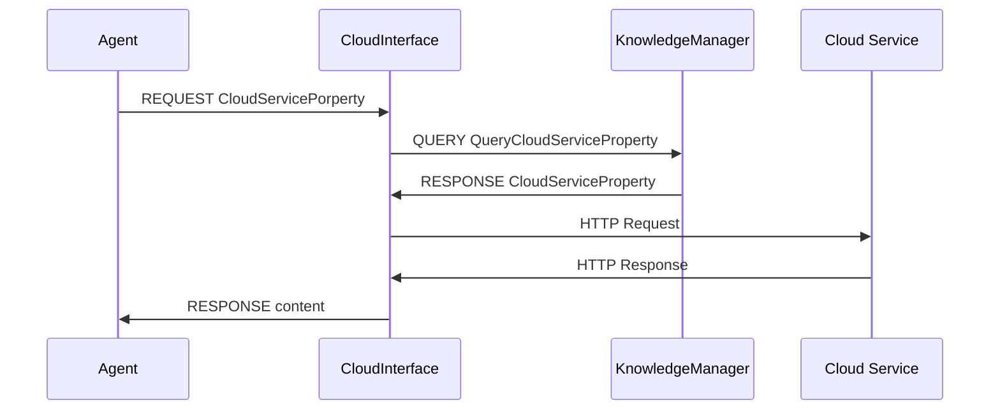

# 클라우드 인터페이스
## 개요
클라우드 인터페이스는 지능체계가 구글, 네이버 등의 클라우드 서비스를 활용할 수 있도록 인터페이스 역할을 수행하는 에이전트다.
지능체계 내의 다른 에이전트들이 클라우드 서비스를 이용해야 할 때 클라우드 인터페이스를 사용하면 인터페이스는 클라우드 서비스를 사용하기 위해 Knowledge Manager로부터 클라우드 서비스를 이용하기 위해 필요한 지식들을 질의해 오며, 질의된 결과를 바탕으로 필요한 인증 절차를 대행해주고,  지식을 바탕으로 웹 서비스의 결과값을 파싱하여 GeneralizedList의 형태로 결과를 반환하게 된다.

## 기능
클라우드 인터페이스는 다른 에이전트의 요청에 따라 외부 웹 서비스를 수행하고 결과값을 반환하게 되어 있다.
클라우드 인터페이스를 사용한 외부 서비스 사용 sequence diagram은 다음과 같다.

### 모델
Cloud Interface는 클라우드 서비스를 정의하는 클라우드 모델이 필요하다. 모델은 다음과 같이 구성되어 있다.

문서 내에 사용된 "MUST", "MUST NOT", "REQUIRED", "SHALL", "SHALL NOT", "SHOULD", "SHOULD NOT", "RECOMMENDED", "OPTIONAL", "OPTIONAL" 키워드는 [RFC 2119](https://www.ietf.org/rfc/rfc2119.txt)에 설명된 대로 해석되어야 한다.

#### CloudService Model
|이름|타입|설명|형식|예시|Requirement Level|
|----|----|-------|---|----|--|
|Provider|String|클라우드 서비스 제공자|일반 String|Google, KMA|REQUIRED|
|Service|String|클라우드 서비스명|일반 String|Calendar, Map, Forecast|REQUIRED|
|Function|String|실행할 기능|일반 String|list, delete, get|REQUIRED|
|Argument|any|클라우드 서비스에 필요한 파라미터|any|{"calendarID":"primary"}|OPTIONAL|
|URL|URL|클라우드 서비스 URL|URL|https://www.googleapis.com/calendar/v3 | REQUIRED|
|Method|HTTP Method|서비스 실행에 필요한 HTTP 메소드|POST GET DELETE PUT|| REQUIRED|
|Authorization|Cloud Auth|API 인증에 필요한 정보|any|{"apiKey":"LOREMIPSUM"}|OPTIONAL|
##### Cloud Authorization
클라우드 서비스는 종류에 따라 OAUTH나 api key 인증 등의 보안 절차가 필요하다. Cloud Authorization 모델은 OAUTH 2.0, api key 인증 방식의 Authorization 정보를 포함하여 외부 클라우드 서비스 활용 시 필요에 따라 인증 절차를 대행할 수 있도록 한다.
###### OAuth 2.0
OAUTH 2.0 방식의 인증이 필요할 때 사용하는 모델이다.

|이름|타입|설명|형식|Requirement Level|
|----|----|----|----|
|ClientKey|String|클라우드 서비스의 API client Key|일반 String|REQUIRED|
|ClientSecret|String|클라우드 서비스의 API Client Secret|일반 String|REQUIRED|
|Scope|String|사용자에게 사용 요청할 Api Scope|일반 String|OPTIONAL|
|RefreshToken|any|클라우드 서비스에 필요한 파라미터|any|OPTIONAL|

###### api key
|이름|타입|설명|형식|Requirement Level
|----|----|----|----|----|
|ApiKey|String|대상 클라우드 서비스의 API Key|일반 String|REQUIRED|

##### Parsing Rule
_주의 : 이 기능은 현재 구현되지 않았습니다._

### 프로토콜

| Sender 	| 타입 	| Receiver 	| GL 	| Argument 	|
|----------------	|----------	|------------------	|----------------------------------------------------------------------------------------------------------------------------------------------------------------------------------------------------------	|-------------------------------------------------------------------------------------------------------------------------------------------------------------------------------------------------------------------------------------------------	|
| Agent 	| Request 	| CloudInterface 	| (CloudService 　(Provider $provider) 　(Service $service) 　(Function $function) 　(Argument $argument) 　(Target $target) ) 	| $provider : 구글,   페이스북, 트위터 등의 서비스 공급자. $service : 서비스 명. Google Maps, Google Calendar Calendarlist 등 $function : API 기능. List / insert / get / Geocoding / Direction 등 $argument : API 인자 	|
| CloudInterface 	| Query 	| KnowledgeManager 	| (QueryCloudServiceProperty 　(Provider $provider) 　(Service $service) 　(Function $function) 　(Target   $target) ) 	| $provider   : 구글, 페이스북, 트위터 등의 서비스 공급자. $service : 서비스 명. Google Maps, Google Calendar Calendarlist 등 $function : API 기능. List / insert / get / Geocoding / Direction 등|
| KM 	| Response 	| CloudInterface 	| OAuth Authorization  (CloudServiceProperty 　(HTTPProperty 　　(Url $url) 　　(Method $method) 　)  　(Auth 　　(ClientID $clientID) 　　(ClientSecret $clientSecret) 　　(Scope $scope) 　　(RefreshToken $refreshToken) 　) ) 	| $url   : 서비스 URL $method : HTTP 프로토콜 메소드. (POST/GET) $clientID : 클라이언트 ID $clientSecret : 클라이언트 시크릿 $scope : 구글 API 사용에 필요한 Scope값 $refreshToken : Access token 발급에 필요한 리프레쉬 토큰 	|
| KM 	| Response 	| CloudInterface 	| API Key authorization (CloudServiceProperty 　(HTTPProperty 　　(Url $url) 　　(Method $method) 　) 　(Auth 　　(ApiKey $apiKey) 　) ) 	| $url : 서비스 URL $method : HTTP 프로토콜 메소드. (POST/GET) $apiKey : API 사용에 필요한 API Key|
| CloudInterface 	| Data 	| Agent 	| (EventList 시 ) (Schedule 　(ScheduleID $scheduleID) 　(Summary $summary) 　(Description   $description) 　(StartTime $startTime) 　(EndTime $endTime) 　(Attendee $attendee) 　(Place $Place) ) 	| $scheduleID   : 스케쥴 ID $summary : 내용 요약 $description : 설명 $startTime : 시작 시간 $endTime : 종료 시간 $attendee : 참석자 명단 $place : 일정 장소 |
| CloudInterface 	| Data 	| Agent 	| (CreateEvent 시 ) (event  　(ID $ID) 　(summary $summary) 　(description $description) 　(startTime $starttime) 　(endTime $endtime) 　(place $place) 　(attendee $attendee) ) 	| $ID : 이벤트 ID $summary : 이벤트 요약 $description : 이벤트 설명 $startTime : 시작 시간(YYYY-MM-DDThh:mm:ss)  $endTime : 종료 시간(YYYY-MM-DDThh:mm:ss) $place : 이벤트 장소 $attendee : 이벤트 참가자(이메일) 	|
| CloudInterface 	| Data 	| Agent 	| (DeleteEvent 시) (ok) 	| 　 	|
| CloudInterface 	| Data 	| Agent 	|  (기상예보 시) (weather $weather) 	| $weather   : 날씨 상태(맑음/많이흐림/비/눈) 	|

## 이슈

 * 현 버전에서는 사용할 수 있는 서비스의 종류가 한정되어 있다.
  * Google Calendar CalendarList list, Google Calendar CalendarList create, Google Calendar CalendarList delete, KMA ForecastSpaceData

<!--stackedit_data:
eyJoaXN0b3J5IjpbNTgzMjgxNzI4XX0=
-->
>
<!--stackedit_data:
eyJoaXN0b3J5IjpbLTE5MjgyNjc1MThdfQ==
-->