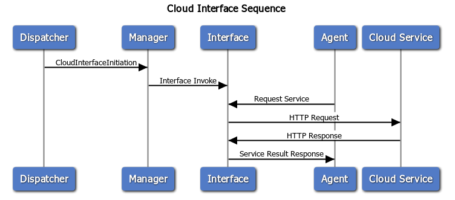

# 클라우드 인터페이스


## 개요
클라우드 인터페이스는 지능체계가 구글, 네이버 등의 클라우드 서비스를 활용할 수 있도록 인터페이스 역할을 수행하는 에이전트다.


지능체계 내의 다른 에이전트들이 클라우드 서비스를 이용해야 할 때 클라우드 인터페이스를 사용하면 인터페이스는 클라우드 서비스를 사용하기 위해 사전에 정의된 클라우드 모델을 참조하여 질의된 결과를 바탕으로 필요한 인증 절차를 대행해주고, 웹 서비스의 결과값을 파싱하여 GeneralizedList의 형태로 결과를 반환하게 된다.

# 설치 환경 및 설치 방법

## 시스템 요구사항

  * Hardware : 60MB 이상의 저장 용량
  * Environment : [JRE/JDK 1.8버전](https://www.oracle.com/technetwork/java/javase/downloads/jdk8-downloads-2133151.html)

## 설치 방법

  * [JRE/JDK 1.8버전](https://www.oracle.com/technetwork/java/javase/downloads/jdk8-downloads-2133151.html) 설치 진행
  * [공개 깃허브](https://github.com/KIST-vision/ARBI-public/edit/master/CloudInterface)에서 Release 탭 내에서 다운로드 가능(예정)

# 실행 방법 및 설정 방법

  * (선택) 압축 해제된 Cloud Interface 폴더 내의 Configuration.xml 파일 텍스트 에디터(메모장, Visual Studio Code, notepad++ 등)로 수정
    * [설정 방법](#설정-방법)에 관해서는 항목 참조. 기본 설정 및 예시 파일은 압축파일 내 Configuration.json 참조

## 윈도우
  1. ArbiFramework 실행(ArbiFramework 문서의 실행 항목 참조)
  2. CloudInterface 폴더 내의 Run.bat 파일 실행

## 리눅스
  1. ArbiFramework 실행(ArbiFramework 문서의 실행 항목 참조)
  2. CloudInterface 폴더 내의 Run.sh 파일 실행

## 개발자용
  1. 터미널 환경(cmd, PowerShell, xfce Terminal, terminator, 기본 Linux Shell 등)에서 java -jar CloudInterface.jar

## 설정 방법
|Name|Description|Example|
|----|-----------|-------|
|--broker, -b|ARBI Framework 브로커의 URL 설정. 기본값 localhost:61616|--broker="127.0.0.1:61616|
|--configuration, -c|Configuration 파일 경로 지정. 기본값은 JAR파일과 같은 폴더 내의 config.json파일(./config.json)|--configuration="C:\configuration.json"|
|--directory, -d | Cloud Interface의 모델 경로 지정. 기본값은 JAR파일이 위치한 현재 경로. | --directory=".\model"
|--help -h|Cloud Interface 사용법 출력|--help|


# 기능

클라우드 인터페이스는 인터페이스를 생성하는 클라우드 인터페이스 매니저와 외부 서비스를 수행하는 클라우드 인터페이스로 나뉜다.


클라우드 인터페이스 매니저는 프로그램 시작 시, 혹은 외부의 요청에 따라 클라우드 모델을 통해 클라우드 인터페이스를 생성한다.


클라우드 인터페이스는 다른 에이전트의 요청에 따라 외부 클라우드 서비스를 수행하고 ARBI Framework의 Agent 프로토콜을 사용하여 결과값을 반환한다.


클라우드 인터페이스를 사용한 외부 서비스 사용 sequence diagram은 다음과 같다.




## 모델
클라우드 인터페이스는 클라우드 서비스를 정의하는 클라우드 모델이 필요하다. 데이터 모델은 Generalized List 형식을 사용하여 작성되며, 실행 시 모델의 경로를 지정하는 방법 외에도 클라우드 인터페이스 매니저에게 Agent 프로토콜을 사용해 요청하는 것으로 클라우드 인터페이스를 추가할 수 있다.


문서 내에 사용된 "MUST", "MUST NOT", "REQUIRED", "SHALL", "SHALL NOT", "SHOULD", "SHOULD NOT", "RECOMMENDED", "MAY", "OPTIONAL" 키워드는 [RFC 2119](https://www.ietf.org/rfc/rfc2119.txt)에 설명된 대로 해석되어야 한다.


|이름|타입|설명|형식|예시|Requirement Level|
|----|----|-------|---|----|--|
|ID|String|Agent 통신에 사용되는 클라우드 인터페이스 식별자|일반 String|"PhilipsHueOn"|REQUIRED|
|Description|String|클라우드 서비스에 대한 설명|일반 String|"필립스 휴 전구 조작을 위한 클라우드 인터페이스"|RECOMMENDED|
|Authorization|String|클라우드 서비스에 필요한 인증 정보<br>자세한 사항은 [항목 참조](####Authorization-Model)|일반 String|항목 참조|REQUIRED|
|Data Model|any|클라우드 모델 내에서 사용되는 변수에 대한 정보<br>자세한 사항은 [항목 참조](####Data-Model)|any|항목 참조|OPTIONAL|
|Communication Model|URL|클라우드 서비스 도중 발생하는 통신 과정과 이로 인한 변수의 할당, 참조 등의 정보를 포함하는 모델.<br> 자세한 사항은 [항목 참조](####Communication-Model)|URL|https://www.googleapis.com/calendar/v3 | REQUIRED|

### Authorization Model
클라우드 서비스는 종류에 따라 OAUTH나 api key 인증 등의 보안 절차가 필요하다. Cloud Authorization 모델은 OAUTH 2.0, api key 인증 방식의 Authorization 정보를 포함하여 외부 클라우드 서비스 활용 시 필요에 따라 인증 절차를 대행할 수 있도록 한다.

#### OAuth 2.0
OAUTH 2.0 방식의 인증이 필요할 때 사용하는 모델이다.

|이름|타입|설명|형식|Requirement Level|
|----|----|----|----|----|
|Provider|String|서비스 제공자|일반 String|REQUIRED|
|ClientKey|String|클라우드 서비스의 API client Key|일반 String|REQUIRED|
|ClientSecret|String|클라우드 서비스의 API Client Secret|일반 String|REQUIRED|
|Scope|String|사용자에게 사용 요청할 Api Scope|일반 String|OPTIONAL|
|RefreshToken|any|클라우드 서비스에 필요한 파라미터|any|OPTIONAL|

OAuth2 모델의 예시 데이터는 다음과 같다.
* Generalized List
```
(OAuth2 "Google" "<api key here>" "<api secret here>" "https://www.googleapis.com/auth/calendar" "<refresh token here>")
```

#### api key

단순 Api Key만을 사용하는 인증 방식에서 필요한 모델이다.

|이름|타입|설명|형식|Requirement Level
|----|----|----|----|----|
|Key|String|대상 클라우드 서비스의 API Key|일반 String|REQUIRED|

Api Key 모델의 예시 데이터는 다음과 같다.
* Generalized List
```
(ApiKey "<Api Key Here>")
```

### Data Model
데이터 모델은 클라우드 인터페이스가 서비스 실행 과정에서 사용하게 될 각종 변수들을 정의하는 모델이다.

|이름|타입|설명|형식|Requirement Level|
|----|----|----|----|----|
|Name|String|변수명|일반 String|REQUIRED|
|Type|String|변수의 타입|일반 String|REQUIRED|

데이터 모델의 예시 데이터는 다음과 같다.
* Generalized List
```
(DataModel (Name "flag") (Type "Boolean"))
```

### Communication Model
커뮤니케이션 모델은 클라우드 서비스 실행 과정에서 사용되는 데이터 변환 규칙에 대해 서술한 모델이다.


|이름|타입|설명|Requirement Level|
|----|----|----|----|----|
|Type|String|서비스 사용에 필요한 프로토콜 타입(기본 HTTP)|REQUIRED|
|MessageModel|MessageModel|사용되는 메시지 모델. HTTP의 경우 Request / Response의 2가지 모델이 필요하다.|REQUIRED|

#### Message Model
커뮤니케이션 모델 내에서 GL과 HTTP 요청 간 변환을 위한 방법을 서술한 모델이다.

|이름|타입|설명|Requirement Level|
|----|----|----|----|----|
|Name|String|해당 메시지 모델의 이름. HTTP 프로토콜의 경우 Request/Response의 2가지 모델이 필요하다.|REQUIRED|
|Input|Template Model|서비스 실행 요청문의 형식 및 양식에 대한 모델.|REQUIRED|
|Output|Template Model|서비스 실행 요청문의 형식 및 양식에 대한 모델.|REQUIRED|

##### Template Model

|이름|타입|설명|Requirement Level|
|----|----|----|----|----|
|Type|String|서비스 실행 요청문의 타입. 현재 버전에선 GL과 HTTPRequest, HTTPResponse만 지원한다.|REQUIRED|
|Contents|GeneralizedList|서비스 실행 요청문의 형식. 요청문의 타입이 GL문일 경우에만 사용된다. 요청된 GL문 중 바인딩 대상이 될 변수의 위치 를 지정할 수 있다.|REQUIRED|
|Method|GeneralizedList|HTTP Request 메소드. POST/PUT/GET/DELETE 중 사용할 서비스에 맞는 형식을 사용한다.|REQUIRED|
|URL|GeneralizedList|HTTP Request 대상 URL.|REQUIRED|
|Header|GeneralizedList|HTTP Request에 포함될 Header 정보. 내부에 들어가는 GL문의 이름이 Key로, 값이 Value로 할당된다.|REQUIRED|
|Body|String|HTTP Request의 Body문. Method가 POST나 PUT일 때에만 사용할 수 있다.|REQUIRED|
|Status|integer|HTTP Response의 Status. 서비스가 정상 실행됐을 때의 Status를 표기한다.|REQUIRED|

## 모델 예시

```
(CloudInterfaceInitiate
    (ID "PhilipsHueOn")
    (Description "Philips Hue On")
    (Authorization (ApiKey "key"))
    (DataModel
        (DataModel (Name "flag")
        (Type "Boolean"))
    )
    (CommunicationModel
        (Type "HTTP")
        
        (MessageModel
            (Name "Request")
            (Input
                (Template
                    (Type "GL")
                    (Contents
                        (PhilipsHueOn $flag)
                    )
                )
            )
            (Output
                (Template
                    (Type "HTTPRequest")
                    (Contents
                        (Method "PUT")
                        (URL "https://192.168.2.181/api/AN1yAyYWkGWChnyvrBEAMgKelqMR3ZlQnYvQanpq/lights/1/state")
                        (Header 
                            (Content-Type "application/json")
                        )
                        (Body "{
                            \"on\": \"$flag\"
                        }")
                    )
                )
            )
        )
        (MessageModel
            (Name "Response")
            (Input
                (Template
                    (Type "HTTPResponse")
                    (Contents
                        (Status 200)
                        (Body "")
                    )
                )
            )
            (Output
                (Template
                    (Type "GL")
                    (Contents
                        (CloudInterfaceResponse "OK")
                    )
                )
            )
        )
    )
)
```

* 서비스 사용 프로토콜 예시
  * Sender : 임의의 Agent
  * Receiver : Model로부터 생성된 Cloud Interface(예시의 경우 cloudInterface#PhilipsHueOn)
  * Protocol : Query, 혹은 Request

```
[Agent Message]	<Request>	agent://www.arbi.com/cimtestdummy --> agent://www.arbi.com/cloudAgent#REST_SMS : (SendSMS "testing" "01047592975")
[Agent Message]	<Response>	agent://www.arbi.com/cloudAgent#REST_SMS --> agent://www.arbi.com/cimtestdummy : (ok)
```

## 실행 예시
* 기본 설정 실행 시(Configuration 파일을 지정하지 않고 시작)
```
Configuration 파일을 찾을 수 없습니다. 기본 설정으로 진행됩니다.
Broker URL : tcp://192.168.2.183:61616 / Agent Name : agent://www.arbi.com/CloudInterfaceManager
File List = [.\PhilipsHueOnModel.gl, .\RestSMSModel.gl]
Agent Invoke at : agent://www.arbi.com/cloudAgent#PhilipsHueOn
[CIM] Cloud Interface Invoked : PhilipsHueOn
Agent Invoke at : agent://www.arbi.com/cloudAgent#REST_SMS
[CIM] Cloud Interface Invoked : REST_SMS
```

* 실행 후 서비스 실행 예시
```
...
Configuration 파일을 찾을 수 없습니다. 기본 설정으로 진행됩니다.
Broker URL : tcp://192.168.2.183:61616 / Agent Name : agent://www.arbi.com/CloudInterfaceManager
File List = [.\PhilipsHueOnModel.gl, .\RestSMSModel.gl]
Agent Invoke at : agent://www.arbi.com/cloudAgent#PhilipsHueOn
[CIM] Cloud Interface Invoked : PhilipsHueOn
Agent Invoke at : agent://www.arbi.com/cloudAgent#REST_SMS
[CIM] Cloud Interface Invoked : REST_SMS
[CIA]Request recieved : (SendSMS "testing" "01047592975")
```
