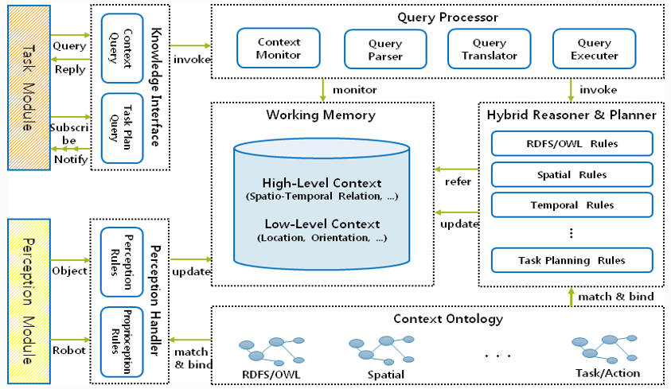

상황 관리기(Context Manager)
===========



# 목차
0. [개요](#개요) 
1. [시스템 요구사항](#시스템-요구사항) 
2. [설치](#설치) 
3. [실행법](#실행법) 
4. [프로토콜, 명령어 사용법 및 예시](#프로토콜,-명령어-사용법-및-예시) 
5. [모델](#모델) 

# 개요
로봇 지능 플랫폼은 지능형 서비스 로봇을 제작하기 위한 프로그램이다. 이 플랫폼은 변화하는 환경과 사용자의 요구에 대응하여 적합한 행동을 선택할 수 있는 로봇을 만들기 위해 개발되었으며, 상황 관리기는 이 지능 로봇 플랫폼의 모듈 중 하나이다.

상황 관리기의 핵심 기능은 로봇의 실시간 인식 정보로부터 저수준 상황 지식을 생성하고 이를 이용하여 로봇, 사용자, 물체, 환경, 작업 등과 관련된 고수준의 상황 지식을 추론하는 것이다.

상황 관리기는 ARBI 프레임워크를 바탕으로 개발되어 있기 때문에 JAVA 언어로 구현되어 있다. 내부 추론 엔진, 작업 메모리 등은 SWI-Prolog로 구현되어 있다.

ARBI 프레임워크에서 상황 관리기의 주요 역할은 작업 관리기가 의사 결정을 할 수 있도록 상황 서술자를 제공하는 것이다. 상황 서술자는 RDF/OWL로 작성된 ARBI 온톨로지를 따르고 있으며 인식 정보로부터 추론되기 때문에 지식 관리기, 인식 관리기와 밀접한 관련이 있다. 

# 시스템 요구사항
Hardware:
- 4 core 4 thread CPU 이상
- 8GB RAM 이상

Environment: 
- JRE 1.8 버전
- swi-prolog 7 버전 이상 및 jpl (bidirectional java/prolog interface)
	(5.10.1 버전의 경우 jpl의 import 방식에 차이가 있음)
- eclipse 통합 개발 환경

# 설치

## 상황 관리기 설치
  * [지능체계 Github]<다운로드 링크>에 접속하여 ContextManager 다운로드
  * 다운로드 받은 압축 파일을 압축 해제
## JRE 설치
  * https://java.com/ko/download 에서 JRE 1.8버전 설치
## 통합 개발환경 설치
  * https://www.eclipse.org/의 download에서 eclipse 설치
## prolog 설치
  * https://www.swi-prolog.org/Download.html 에서 prolog 7버전 이상 설치
## prolog 경로 환경설정
  * eclipse 설정
	* jpl.jar를 ContextManager 프로젝트에 external jar로 추가
    * Linux 환경
	  * kgu.agent.demo하위 ContextManagerLauncher.java의 run configuration 설정
	  * Arguments 탭의 VM arguments 설정
	  * Environment 탭의 Variable과 Value 설정
	* Windows 환경
	  * kgu.agent.demo하위 ContextManagerLauncher.java의 run configuration 설정
	  * Arguments 탭의 VM arguments 설정
	  * Environment 탭의 Variable과 Value 설정
  * eclipse를 사용하지 않는 경우 별도의 path 설정 필요
    * Linux: ~./bashrc에 LD_LIBRARY_PATH, LD_PRELOAD, SWI_HOME_DIR, PATH 설정
	* Windows: 시스템 설정에서 PATH를 설정
### prolog 경로 환경설정 예시
  * Linux 환경
	* Arguments 탭의 VM arguments 설정
		-Djava.library.path="/usr/lib/swi-prolog/lib/x86_64-linux"
	* Environment 탭의 Variable과 Value 설정
		Variable: LD_PRELOAD, Value: /usr/lib/swi-prolog/lib/x86_64-linux/libswipl.so
		Variable: PATH, Value: /usr/lib/swi-prolog/bin
		Variable: SWI_HOME_DIR, Value: /usr/lib/swi-prolog
  * Windows 환경
  * Arguments 탭의 VM arguments 설정
		-Djava.library.path="D:\swiprolog\swipl\bin;."
	* Environment 탭의 Variable과 Value 설정
		Variable: PATH, Value: D:\swiprolog\swipl\bin;${env_var:PATH}
  
## Broker Configuration 설정
  * 압축 해제된 폴더 안의configuration/Configuration.xml 파일 설정을 통해 Agent의 정보 입력
    * ServerURL : 사용하는 메시지 브로커가 동작하고 있는 주소와 포트
    * AgentName : 해당 Agent의 주소로 사용할 이름
    * BrokerType : 사용하는 메시지 브로커의 종류(ZeroMQ/Apollo 중 하나 선택)
	* JMS_BROKER_URL : 사용하는 메시지 브로커가 동작하고 있는 주소와 포트
	* TM_ADDRESS : TaskManager Agent의 주소로 사용할 이름
	* CM_ADDRESS : 해당(ContextManager) Agent의 주소로 사용할 이름
	* KM_ADDRESS : KnowledgeManager Agent의 주소로 사용할 이름
	* BEHAVIOUR_INTERFACE_ADDRESS : BehaviorInterfaceManager Agent의 주소로 사용할 이름
	* PERCEPTION_ADRESS : PeceptionManager Agent의 주소로 사용할 이름
	* ACTION_ADDRESS : Action 표기를 위한 주소로 사용할 이름
	* TASKLOG_ADDRESS : TaskLog 표기를 위한 주소로 사용할 이름
	* DC_URL : 업로드하는 지식을 표기를 위한 주소로 사용할 이름
	
### Configuration 예시

```
	public static final String JMS_BROKER_URL = "tcp://127.0.0.1:61616";
	public static final String TM_ADDRESS = "agent://www.arbi.com/taskManager";
	public static final String CM_ADDRESS = "agent://www.arbi.com/contextManager";
	public static final String KM_ADDRESS = "agent://www.arbi.com/knowledgeManager";
	public static final String BEHAVIOUR_INTERFACE_ADDRESS = "agent://www.arbi.com/behaviourInterface";
	public static final String PERCEPTION_ADRESS = "agent://www.arbi.com/perception";
	public static final String ACTION_ADDRESS = "agent://www.arbi.com/action";
	public static final String TASKLOG_ADDRESS = "agent://www.arbi.com/TaskLog";
	public static final String DC_URL = "dc://CM";
```

# 실행법
## 윈도우
  1. ArbiFramework 실행(ArbiFramework 문서의 실행 항목 참조)
  2. ContextManager 폴더 내에 위치한 ContextManagerLauncher.java 파일 실행

## 리눅스
  1. ArbiFramework 실행(ArbiFramework 문서의 실행 항목 참조)
  2. ContextManager 폴더 내에 위치한 ContextManagerLauncher.java 파일 실행

## 실행 예시
```
이클립스에서 ContextManagerLauncher.java파일 실행
use_module(library('semweb/rdf_db')) succeeded
use_module(library('jpl')) succeeded
jpl_new('kgu.agent.demo.agent.ContextManager', [], CM), nb_setval(cm, CM) succeeded
======Start Context_Manager======
[prolog/init] succeeded
.....
```

브로커를 찾지 못했을 경우에는 다음과 같이 실행 도중 정지한다.
```
    이클립스에서 ContextManagerLauncher.java파일 실행
    use_module(library('semweb/rdf_db')) succeeded
	use_module(library('jpl')) succeeded
	jpl_new('kgu.agent.demo.agent.ContextManager', [], CM), nb_setval(cm, CM) succeeded
	javax.jms.JMSException: Could not connect to broker URL: tcp://127.0.0.1:61616. Reason: java.net.ConnectException: Connection refused: connect

```

# 프로토콜, 명령어 사용법 및 예시

* 상황 관리기는 다른 Agent들로부터 추론에 필요한 정보를 수신할 수 있고, 추론 결과에 대한 내용을 송신할 수 있다. 상황 관리기가 수용 가능한 프로토콜의 경우 다음과 같다. GL에 대한 명세는 ArbiFramework 문서를 참조

## GL 프로토콜 개요

| GL Name | Type | Description | Argument |
|---------|------|-------------|----------|
|AssertFact|Request|WorkingMemory에 특정 Relation을 추가|$factName<br>$argument|
|RetractFact|Request|WorkingMemory에 특정 Relation을 제거|$factName<br>$argument|
|UpdateFact|Request|WorkingMemory에 특정 Relation을 갱신|$oldFactName<br>$newFactName<br>$newFactArgument|
|Context|LTMSubscription|LTM에서 Context 정보를 받아와 Relation에 추가|$contextName<br>$argument|


## 프로토콜 상세 설명
### AssertFact
* WorkingMemory에 특정 Relation을 추가
1. GL 요청 형식
```
(AssertFact ($perceptionName $argument1 $argument2...))
```
  * $perceptionName : 인식한 perceptionName
  * $argument : 인식한 perception의 인자
2. 예시
```
(AssertFact (visualObjectPerception “cup01” "perception01"))
```
### RetractFact
* WorkingMemory에 특정 Relation을 제거
1. GL 요청 형식
```
(RetractFact ($predicate $argument1 $argument2...))
```
  * $predicate : 제거할 perceptionName
  * $argument : 제거할 perception의 인자
2. 예시
```
(RetractFact (visualObjectPerception “cup01” "perception01"))
```
### UpdateFact
* WorkingMemory에 특정 Relation을 갱신
1. GL 요청 형식
```
(UpdateFact ($predicate $argument1 $argument2...))
```
  * $predicate : 갱신할 perceptionName
  * $argument : 갱신할 perception의 인자
2. 예시
```
(UpdateFact (visualObjectPerception “cup01” "perception01"))
```
### Context
* 추론할 질의문을 요청받고, 추론한 질의문을 응답을 채워 전달
1. GL 요청 형식
```
(context ($predicate $argument1 $argument2...))
```
  * $predicate : 질의할 서술자 
  * $argument : 추론에 필요한 인자
2. 예시
```
(context (graspedBy “cup01” "left_hand01"))
```

# 모델
ContextManager는 내부에 추론을 하기 위해서 Prolog를 사용하고 있다. 따라서 ContextManager에 새로운 추론 서술자를 생성하기 위해선 Prolog 언어를 사용하여 작성하여야 한다.

Prolog 언어는 다음과 같이 구성되어 있다.

predicate_name(A,B):-  = 가장 왼쪽에는 서술자의 이름, 괄호 안에는 파라미터들 :-이후에는 서술자의 규칙들을 정의한다.
규칙들은 필요에 따라 라이브러리에서 검색하여 사용한다. 라이브러리 검색은 아래 사이트에서 할 수 있다.
https://www.swi-prolog.org/pldoc/doc_for?object=section(%27packages/semweb.html%27)
