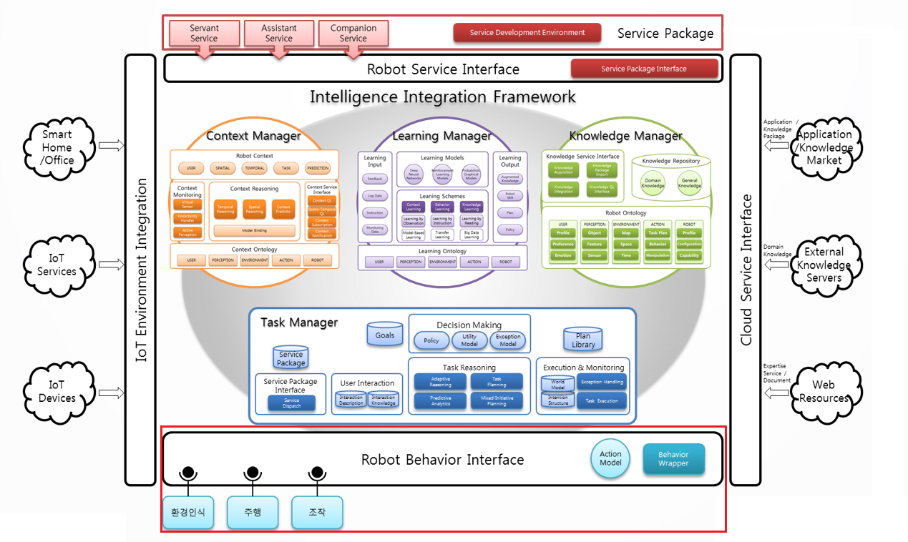
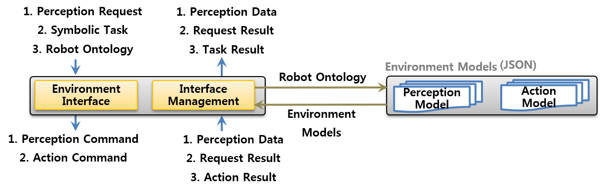

#Interface Layer#

아키텍쳐 도식 중 하단의 붉은 사각형이 InterfaceLayer이다.

## 개요 ##
Interface Layer는 로봇 지능 프레임 워크가 실제 로봇에서 동작하도록 인터페이스 역할을 수행하는 에이전트다.

지능체계 내의 에이전트에서 로봇을 작동시키기 위해 GeneralizedList 형태의 데이터를 보내면 Interface Layer에서 이를 로봇이 읽고 처리할 수 있는 형태의 데이터로 변형시키고 전달해준다. 또한 로봇에서 처리된 데이터를 지능체계 내의 에이전트에서 이용할 수 있도록 GeneralizedList 형태의 데이터로 변형하여 전달한다.

## 기능 ##
Interface Layer는 에이전트의 데이터를 변형하여 로봇에 전달하고 또 로봇에서 얻은 데이터를 에이전트가 이용할 수 있는 데이터로 변환한다. 로봇의 action과 perception기능을 담당한다. 이 과정의 시퀀스 다이어그램은 다음과 같다.

## 모델 ##
Interface Layer는 로봇의 action과 perception의 데이터를 처리하기 위해서 JSON을 사용하고 있다. 따라서 새로운 형태의 action과 perception을 이용하기 위해 JSON 언어를 사용하여 작성하여야 한다.

## 프로토콜 ##

Sender|Type|Description|Receiver|GL|Argument
---|---|---|---|---|---
Perception|Request|Bumper|Interface Layer|(Robot_bumper ($time) ($state))|$time: 인식시간  $state: 범퍼상태 
Perception|Request|Wheel_drop|Interface Layer|(Robot_wheeldrop ($time) ($state))|$time: 인식시간  $state: 바퀴 들림 상태 
Perception|Request|Ciff|Interface Layer|(Robot_cliff ($time) ($state))|$time: 인식시간  $state: cliff센서 상태 
Perception|Request|Charger|Interface Layer|(Robot_charger ($time) ($state))|$time: 인식시간  $state: 충전상태 
Perception|Request|Battery|Interface Layer|(Robot_battery ($time) ($gauge))|$time: 인식시간  $gauge: 배터리 상태 값
Perception|Request|Orientation|Interface Layer|(Robot_orientation ($time) ($orientation z w))|$time: 인식시간  $orientation: 로봇방향 z,w좌표 
Perception|Request|Robot Position|Interface Layer|(Robot_position ($time) ($position x y))|$time: 인식시간  $position: 로봇위치 x,y,z좌표 
Perception|Request|Human Tracking|Interface Layer|(Human_tracking ($time) ($userID) (physical_state $state) (position $x $y $z))|$time: 인식시간  $userID: 객체고유ID  $physical_state: 객체상태  $position: 객체위치  
Perception|Request|Speech To Text|Interface Layer|(Human_recognition ($time) ($ID) (사용자 이름 “객체 명”))|$time: 인식시간  $ID: 장치명  $사용자 이름: 객체 명 
Perception|Request|Face Detection/ Recognition |Interface Layer|(Human_tracking ($time) ($ID) ($position x y z))|$time: 인식시간  $ID: 객체ID  $position: 객체위치
Action|Request|Move|Interface Layer|(move ($position x y z) ($actionID))|$position: 좌표  $actionID: actionID 
Action|Request|Turn|Interface Layer|(ahead ($type) ($type) ($actionID))|$type: 종류  $type: 값  $actionID: actionID 
Action|Request|Text to Speech|Interface Layer|(speak ($textToSpeech) $actionID)|$textToSpeech: 문장  $actionID: actionID

