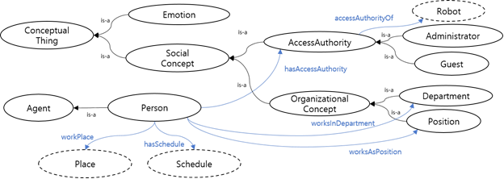
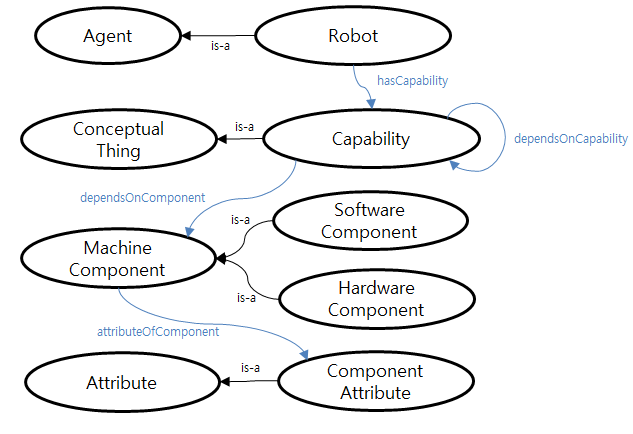
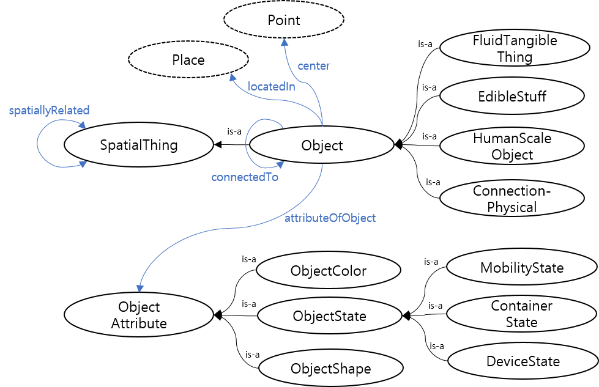
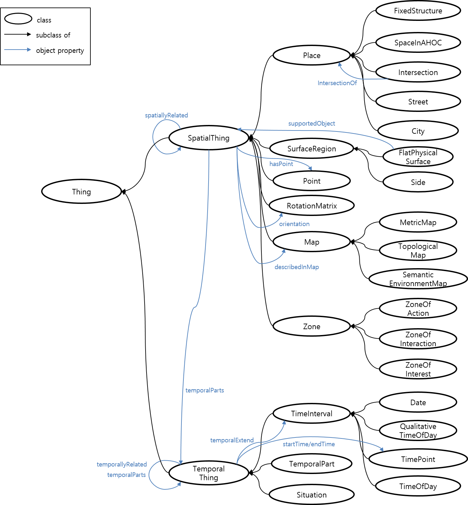
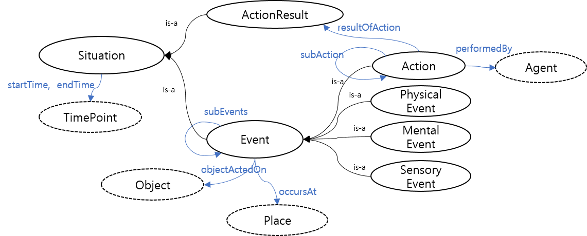

# 지능형 서비스 로봇 온톨로지 ISRO Intelligent Service Robot Ontology

## 온톨로지 구조

## 온톨로지 구성요소

### 사용자 온톨로지 User Ontology
사용자 온톨로지는 서비스의 대상이 되는 사용자의 정보를 표현하기 위한 온톨로지로 서비스 제공에 필요한 사용자의 프로파일, 감정적 상태 등을 구체화하여 정의한다. 사용자 프로파일은 사회적 관계, 로봇에 대한 접근 권한 등을 포함한다.

|클래스|의미|
|-|-|
|Person|로봇 서비스 사용자|
|SocialConcept|사회적 개념|
|AccessAuthority|접근 권한|
|OrganizationalConcept|조직 관계(부서, 직위 등)|
|Emotion|감정 상태|
|Schedule|일정|

### 로봇 온톨로지 Robot Ontology
로봇 온톨로지는 개인화 서비스 수행의 주체인 로봇과 관련된 정보를 정의한 온톨로지이다. 로봇 온톨로지에서는 여러 종류의 서비스 로봇이 표현되고, 각 로봇은 서로 다른 수행 능력(hasCapability 관계 속성)과 이에 대한 로봇 구성 요소가 정의되어 있다. 수행 능력은 동작 관련 능력, 인식 관련 능력 등 로봇의 행위를 수행하기 위한 다양한 능력이 정의되며 해당 수행 능력을 수행하는 데에 필요한 로봇 구성 요소(dependsOnComponent 관계 속성) 혹은 다른 수행 능력 (dependsOnCapability관계 속성)을 포함한다.

|클래스|의미|
|-|-|
|Robot|서비스 로봇|
|Capability|서비스 수행 능력|
|SoftwareComponent|소프트웨어 구성 요소|
|HardwareComponent|하드웨어 구성 요소|
|ComponentAttribute|구성 요소 속성|

### 인지 온톨로지 Perception Ontology
인지 온톨로지는 서비스 환경 내 물체 정보를 표현하는 온톨로지이다. 인지 온톨로지에서는 유형 별 다양한 물체와 물체의 속성에 대한 정의를 포함한다.

|클래스|의미|
|-|-|
|ConnectionPhysical|물체 접합 부분 (경첩, 로봇 관절 등)|
|HumanScaleObject|인간 척도의 물체|
|FluidTangibleThing|액체 유형 물체|
|EdibleStuff|식용 가능 물체|
|ObjectColor|물체 색상|
|ObjectShape|물체 형태|
|ObjectState|물체의 상태(이동성, 장치 On/Off, 개폐 상태 등)|

### 환경 온톨로지 Environment Ontology
환경 온톨로지는 로봇이 서비스를 수행함에 있어서 로봇이 인식하는 저레벨의 실환경을 로봇이 이해할 수 있도록 고레벨의 지식으로 매핑하는 중요한 지식 개념을 포함한다. 환경 온톨로지에서는 로봇이 서비스를 수행하는 다양한 환경적 요소가 정의된다. 서비스 환경의 시공간의 표현 체계, 실환경을 추상화하기 위한 맵과 좌표의 표현 체계, 그리고 공간 간, 시공간 간, 시간 간의 연관 관계 등이 환경 온톨로지를 통해 표현된다.

#### 공간적 개념 표현
|클래스|의미|
|-|-|
|FixedStructure|고정 구조물|
|SpaceInAHOC|인간 거주지 내 공간|
|Intersection|교차 지역|
|RoomInAConstruction|건물 내 방|
|FlatPhysicalSurface|표면 공간|
|Side|경계 공간 (ex. 벽)|

#### 환경 맵 표현
|클래스|의미|
|-|-|
|MetricMap|수치(좌표)가 표현된 맵|
|TopologicalMap|위상학적 관계가 표현된 맵|
|SemanticMap|의미 관계가 표현된 맵|
|MapBuiltFromSensorData|인식 데이터 기반 맵|
|CollisionMap|로봇 구성품 충돌 방지 맵|
|Point|맵 상 좌표|
|RotationMatrix|물체의 회전 개념을 포함하는 좌표|
|Zone|맵 내 특정 구역|

#### 시간적 개념 표현
|클래스|의미|
|-|-|
|Date|날짜 (ex. 요일 등)|
|QualitativeTimeOfDay|정성적 시간 (ex. 아침, 저녁 등)|
|TimePoint|특정 시점|
|TimeOfDay|특정적인 시간 표현(ex. 근무시간, 운영시간 등)|
|TemporalPart|특정 시간에서의 대상의 일부분|

#### 공간적 관계속성
|클래스|의미|
|-|-|
|linkedTo|위상적인 지점 간의 연결 관계|
|locatedAtAbsolute|절대적 위치|
|locatedAtRelative|상대적 위치|
|locationOf|위치 장소(locatedAt의 역관계)|
|spatialCotemporalPredicate|동시발생적인 위치관계|

#### 시간적 관계속성
|클래스|의미|
|-|-|
|startTime|시작 시간|
|endTime|종료 시간|
|intervalRelations|상대적 시간 관계|
|temporalExtend|TemporalPart의 시간 정보|
|temporalParts|TemporalPart의 대상|

### 행위 온톨로지 Action Ontology
행위 온톨로지는 개인화 서비스 수행을 위한 로봇의 행위에 대한 온톨로지로, 로봇의 행위는 실질적인 일련의 동작이자 하나의 상황적 사건으로써 정의된다. 구체적으로 행위는 로봇의 공간적 이동, 물체를 쥐거나 옮기는 조작, 지식을 활용한 논리적 추론, 물체 인식 등 로봇의 물리적, 정신적, 인식적 행위를 의미하며, 각 행위는 다수의 부수적 행위, 행위 주체, 행위 대상, 발생 장소, 발생 시작/끝 시간 등에 대한 정보를 포함한다.

|클래스|의미|
|-|-|
|Action|로봇의 실질적 동작|
|ActionResult|로봇 동작의 결과(완료, 실패, 중단 등)|
|PhysicalEvent|물리적 사건|
|MentalEvent|정신적 사건|
|SensoryEvent|인식적 사건|

