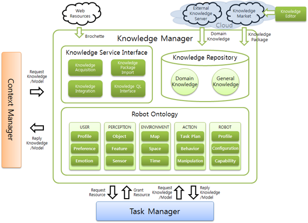
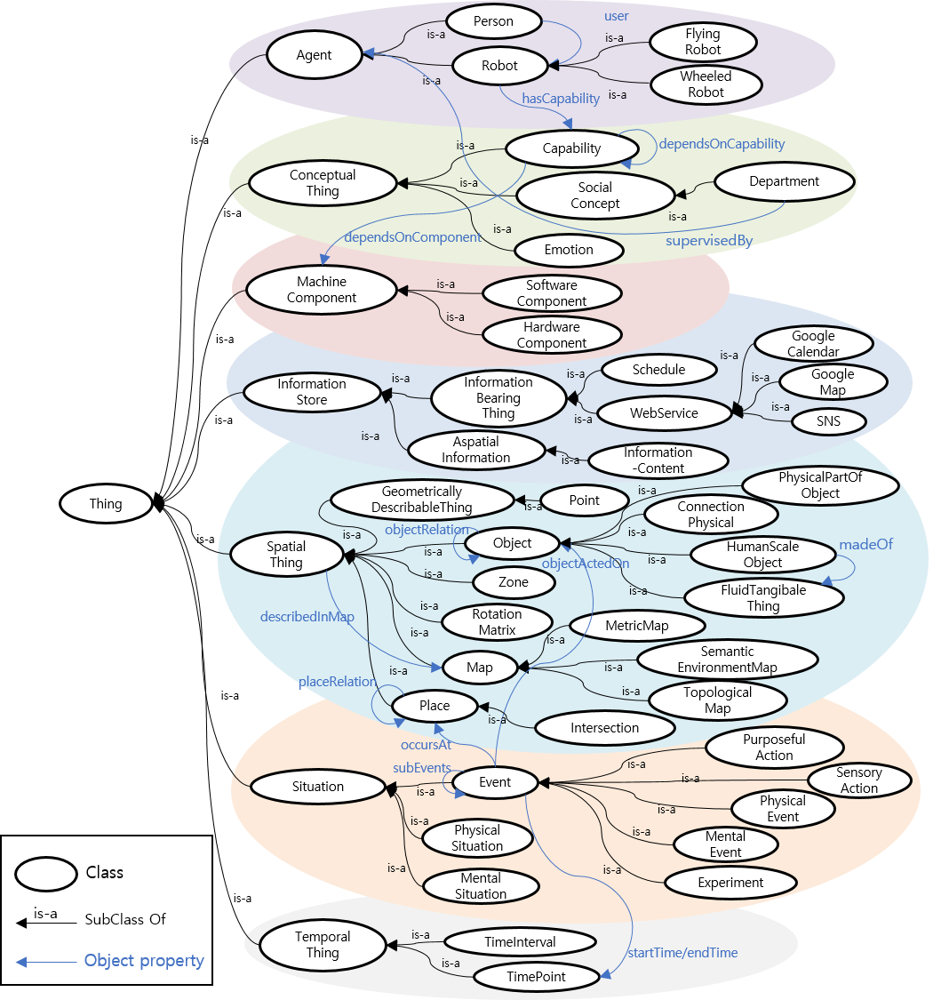
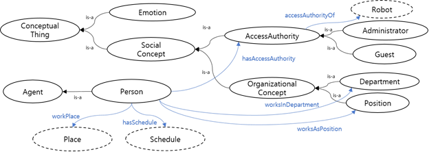
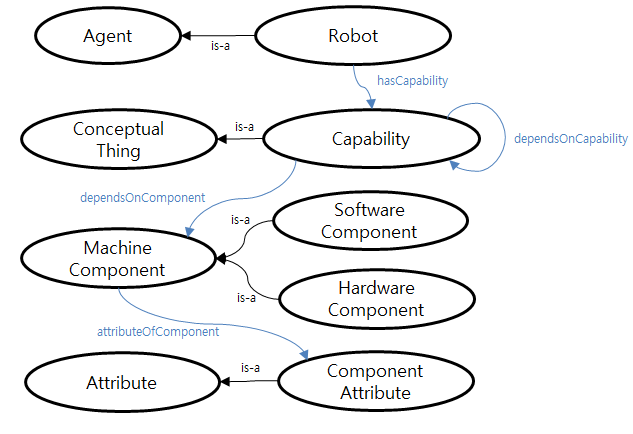
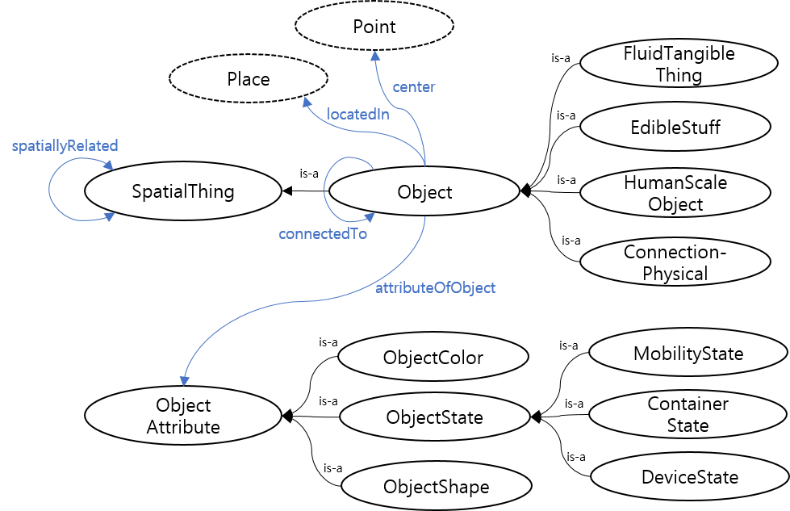
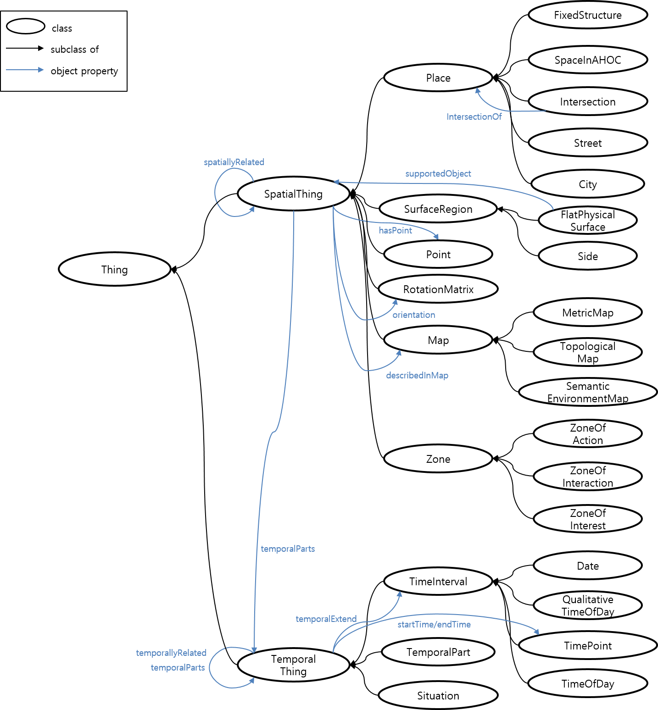
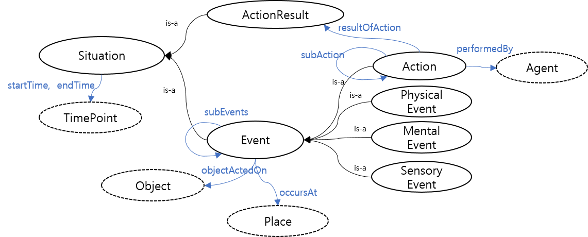

KnowledgeManager
================



# 목차
0. [개요](#0-개요)
1. [시스템 요구사항](#1-시스템-요구사항)
2. [설치 및 실행 방법](#2-설치-및-실행-방법)
3. [KM 프로토콜](#3-km-프로토콜)
4. [온톨로지](#4-온톨로지)

# 0. 개요
로봇 지능 플랫폼은 지능형 서비스 로봇을 제작하기 위한 프로그램이다. 이 플랫폼은 변화하는 환경과 사용자의 요구에 대응하여 적합한 행동을 선택할 수 있는 로봇을 만들기 위해 개발되었으며, KnowledgeManager(KM) 는 이 지능 로봇 플랫폼의 모듈 중 하나이다.

KM은 사용자, 인지, 환경, 행위, 로봇 프로파일 등을 표현하는 로봇 온톨로지(Ontology)를 기반으로 로봇의 지능적인 서비스 수행에 필요한 전반적인 지식을 제공하는 모듈이다.

#### KnowledgeManager의 기능
* 지능 로봇 서비스를 위한 온톨로지의 효율적인 관리 (지식 추가, 지식 제거)
* 서비스 runtime에 타 agent로부터 요청받는 지식 질의 및 지식 추론 처리

# 1. 시스템 요구사항

#### Environment
* JRE 1.8 이상
* ArbiFramework

# 2. 설치 및 실행 방법
## 설치
### JRE
* [자바 홈페이지](http://java.com/ko/download) 에서 JRE 다운로드 및 설치

### ArbiFramework
* [지능체계 깃허브](https://github.com/KIST-vision/ARBI-public/tree/master/ARBI)에서 다운로드 및 설치 (자세한 설치 방법은 ArbiFramework 문서의 설치 항목 참조)

### KnowledgeManager

* [지능체계 깃허브](http://github.com/KIST-vision/ARBI-public/tree/master/KnowledgeManager) 접속하여 KnowledgeManager 다운로드 후 압축 풀기


## 실행 방법

1. ArbiFramework 실행 (ArbiFramework 문서의 실행 항목 참조)

2. 압축 해제한 폴더 안의 configuration/KmConfiguration.xml 파일 설정을 통해 Agent의 정보 입력

   * argument 설명

     * OS : 실행하는 운영체계 서술 (WINDOW/LINUX) 중 하나 선택
     * ServerURL : 사용하는 메시지 브로커가 동작하고 있는 주소와 포트
     * AgentName : 해당 Agent의 주소로 사용할 이름
     * BrokerType : 사용하는 메시지 브로커의 종류(ZeroMQ/Apollo 중 하나 선택)

   * KmConfiguration.xml 예시

     ```xml
     <?xml version="1.0?>
     <Agent-Property>
         <OS>WINDOW</OS>
         <ServerURL>tcp://172.16.165.102:61616</ServerURL>
         <AgentName>agent://www.arbi.com/knowledgeManager</AgentName>
         <BrokerType>ZeroMQ</BrokerType>
     </Agent-Property>
     ```

3. KnowledgeManager 실행

   * cmd 창에서 km.jar 파일 실행

   * 실행 예시

     ```shell
     C:\> cd KnowledgeManager
     C:\KnowledgeManager> java -jar km.jar
     +++++++++++++++++++++++++++++++
     +   Knowledge Manager Start   +
     +++++++++++++++++++++++++++++++
     
     LoggerManager Registering
     
     Welcome to Initialize!
     ...
     ```

# 3. KM 프로토콜

* KnowledgeManager(KM)는 로봇 서비스에 필요한 지식의 추가/제거/질의/추론을 처리하는 Agent이다. 다른 Agent는 로봇의 지식에 접근하기 위해서 KM에 지식 처리 요청을 해야 한다. 지식 처리 요청 프로토콜은 GL 형식으로 이루어져있고 KM의 프로토콜은 다음과 같다. (GL에 대한 명세는 ArbiFramework 문서를 참조)

##  프로토콜 개요


|<br>Type |<GL<br>Operation|Name><br>Target|<br>Argument                                                     |<br>Description|
|:-------:|---------------:|:--------------|:----------------------------------------------------------------|:--------------|
|*Request*|          create|Class          |$superClass<br>$class                                            |Ontology에 새로운 클래스 추가|
|*Request*|          create|Property       |$propertyType<br>$superProperty<br>$property<br>$domain<br>$range|Ontology에 새로운 프로퍼티 추가|
|*Request*|          create|Individual     |$typeClass<br>$individual                                        |Ontology에 새로운 인디비주얼 추가|
|*Request*|          create|Relation       |$subject<br>$property<br>$object                                 |Ontology에 새로운 관계 Triple(*S-P-O*) 추가|
|*Request*|          delete|Class          |$superClass<br>$class                                            |Ontology에서 기존 클래스 제거|
|*Request*|          delete|Property       |$propertyType<br>$superProperty<br>$property<br>$domain<br>$range|Ontology에서 기존 프로퍼티 제거|
|*Request*|          delete|Individual     |$typeClass<br>$individual                                        |Ontology에서 기존 인디비주얼 제거|
|*Request*|          delete|Relation       |$subject<br>$property<br>$object                                 |Ontology에서 기존 관계 Triple(*S-P-O*) 제거|
| *Query* |           query|Relation       |$subject<br>$property<br>$object                                 |관계 Triple(*S-P-O*) 질의|
| *Query* |           query|CloudRelation  |$subject<br>$property<br>$object                                 |클라우드 질의|
| *Query* |           query|MultiRelation  |$subject<br>$property<br>$object                                 |*Chained* 관계 Triple(*S-P-O*) 질의|
|*Request*|         request|Path           |$returnType<br>$x $y $z<br>$departure $destination               |출발지에서 도착지까지의 최단경로 추론|
|*Request*|         request|Recommendation |$user<br>$targetAction                                           |목적 행위와 사용자에 따른 적절한 object 추론|

## 프로토콜 상세 설명
### createClass
서비스용 온톨로지 모델에 새로운 클래스 추가
* GL format
```
(createClass $superClass $class)
```
* Arguments
  * $superClass : 새로운 클래스의 상위 클래스 (IRI 형식)
  * $class : 새로운 클래스 (IRI 형식)

* Example
```java
(createClass "http://robot-arbi.kr/ontologies/isro_social.owl#MentalDisease" "http://robot-arbi.kr/ontologies/SERVICE_NAME.owl#Schizophrenia")
```

### createProperty
서비스용 온톨로지 모델에 새로운 프로퍼티 추가
* GL format
```
(createProperty $propertyType $superProperty $property $domain $range)
```
* Arguments
  * $propertyType : "Objectproperty" 또는 "Datatype property"
  * $superProperty : 새로운 프로퍼티의 상위 프로퍼티 (IRI 형식)
  * $property : 새로운 프로퍼티 (IRI 형식)
  * $domain : 새로운 프로퍼티의 domain (정의하고 싶지 않을 경우, $domain에 값을 채우지 않고 그대로 질의)
  * $range : 새로운 프로퍼티의 range (정의하고 싶지 않을 경우, $range에 값을 채우지 않고 그대로 질의)

* Example
```java
(createProperty "ObjectProperty" "http://robot-arbi.kr/ontologies/isro_medical.owl#getDisease" "http://robot-arbi.kr/ontologies/SERVICE_NAME.owl#getPhysicalDisease" "http://knowrob.org/kb/knowrob.owl#Person" "http://robot-arbi.kr/ontologies/isro_medical.owl#PhysicalDisease")

(createProperty "DatatypeProperty" "http://www.w3.org/2002/07/owl#topDataProperty" "http://robot-arbi.kr/ontologies/SERVICE_NAME.owl#myDatatypeProperty" $domain $range)
```

### createIndividual
서비스용 온톨로지 모델에 새로운 인디비주얼 추가
* GL format
```
(createIndividual $typeClass $individual)
```
* Arguments
  * $typeClass : 새로운 인디비주얼의 타입 클래스
  * $individual : 새로운 인디비주얼 (IRI 형식)

* Example
```java
(createIndividual "http://robot-arbi.kr/ontologies/isro_medical.owl#Schizophrenia" "http://robot-arbi.kr/ontologies/SERVICE_NAME.owl#_Schizophrenia")
```

### createRelation
서비스용 온톨로지 모델에 새로운 관계 Triple(*S-P-O*) 추가
한 개의 관계 Triple을 추가할 할 뿐만 아니라 하나의 주어에 대한 여러 관계 Triple을 동시에 추가하는 것이 가능.
* GL format
```
(createRelation $subject (predicate $property $object) (predicate $property $object) ... )
```
* Arguments
  * $subject : 새로운 관계 Triple 의 주어
  * $property : 새로운 관계 Triple 의 서술어
  * $object : 새로운 관계 Triple 의 목적어

* Example
```java
(createRelation "http://robot-arbi.kr/ontologies/isro.owl#FaceRecognition" (predicate "http://robot-arbi.kr/ontologies/isro_social.owl#faceID" "001"))

(createRelation "http://robot-arbi.kr/ontologies/SERVICE_NAME.owl#Person001" (predicate "http://robot-arbi.kr/ontologies/isro_medical.owl#getDisease" "http://robot-arbi.kr/ontologies/SERVICE_NAME.owl#_Schizophrenia"))
```

### deleteClass
서비스용 온톨로지 모델에서 기존 클래스 제거.
제거하려는 클래스에 하위 클래스가 존재하면 제거 불가 메시지 반환.
* GL format
```
(deleteClass $superClass $class)
```
* Arguments
  * $superClass : 제거할 클래스의 상위 클래스 (IRI 형식)
  * $class : 제거할 클래스 (IRI 형식)

* Example
```java
(deleteClass "http://robot-arbi.kr/ontologies/isro_medical.owl#MentalDisease" "http://robot-arbi.kr/ontologies/SERVICE_NAME.owl#Schizophrenia")
```

### deleteProperty
서비스용 온톨로지 모델에서 기존 프로퍼티 제거.
제거하려는 프로퍼티의 usage가 존재하면 제거 불가 메시지 반환.
* GL format
```
(deleteProperty $propertyType $superProperty $property $domain $range)
```
* Arguments
  * $propertyType : "Objectproperty" 또는 "Datatype property"
  * $superProperty : 제거할 프로퍼티의 상위 프로퍼티 (IRI 형식)
  * $property : 제거할 프로퍼티 (IRI 형식)
  * $domain : 제거할 프로퍼티의 domain (정의하고 싶지 않을 경우, $domain에 값을 채우지 않고 그대로 질의)
  * $range : 제거할 프로퍼티의 range (정의하고 싶지 않을 경우, $range에 값을 채우지 않고 그대로 질의)

* Example
```java
deleteProperty "ObjectProperty" "http://robot-arbi.kr/ontologies/isro_medical.owl#getDisease" "http://robot-arbi.kr/ontologies/SERVICE_NAME.owl#getPhysicalDisease" "http://knowrob.org/kb/knowrob.owl#Person" "http://robot-arbi.kr/ontologies/isro_medical.owl#PhysicalDisease")

(deleteProperty "DatatypeProperty" "http://www.w3.org/2002/07/owl#topDataProperty" "http://robot-arbi.kr/ontologies/SERVICE_NAME.owl#myDatatypeProperty" $domain $range)
```

### deleteIndividual
서비스용 온톨로지 모델에서 기존 인디비주얼 제거.
* GL format
```
(deleteIndividual $typeClass $individual)
```
* Arguments
  * $typeClass : 제거할 인디비주얼의 타입 클래스
  * $individual : 제거할 인디비주얼 (IRI 형식)

* Example
```java
(deleteIndividual "http://robot-arbi.kr/ontologies/isro_medical.owl#Schizophrenia" "http://robot-arbi.kr/ontologies/SERVICE_NAME.owl#_Schizophrenia")
```

### deleteRelation
서비스용 온톨로지 모델에서 기존 관계 Triple(*S-P-O*) 제거
* GL format
```
(deleteRelation $subject $property $object)
```
* Arguments
  * $subject : 새로운 관계 Triple 의 주어
  * $property : 새로운 관계 Triple 의 서술어
  * $object : 새로운 관계 Triple 의 목적어

* Example
```java
(deleteRelation "http://robot-arbi.kr/ontologies/SERVICE_NAME.owl#Person001" "http://robot-arbi.kr/ontologies/isro_medical.owl#getDisease" "http://robot-arbi.kr/ontologies/SERVICE_NAME.owl#_Schizophrenia")
```

### requestPath
현재 로봇이 위치한 출발지로부터 목적지까지의 최단경로 추론
반환 타입을 설정하여 좌표값 리스트 또는 시맨틱맵 상 경로 이름 리스트 또는 액션리스트로 결과를 받을 수 있다.
* GL format
```
(requestPath $type (currentPoint $x $y $z) $departure $destination)

```
* Arguments
  * $type : 경로 추론 결과의 반환 타입 "coordinate" or "name" or "action"
  * $x $y $z : 매트릭 맵 상 로봇의 현재 위치 좌표값
  * $departure : 출발지의 시맨틱 맵 상 이름
  * $destination : 목적지의 시맨틱 맵 상 이름

* Example
```java
(requestPath "coordinate" (currentPoint 2.0 3.0 0.0) "http://robot-arbi.kr/ontologies/isro_map.owl#OfficeRoom001" "http://robot-arbi.kr/ontologies/isro_map.owl#OfficeRoom002")

(requestPath "name" (currentPoint 2.0 3.0 0.0) "http://robot-arbi.kr/ontologies/isro_map.owl#OfficeRoom001" "http://robot-arbi.kr/ontologies/isro_map.owl#OfficeRoom002")

(requestPath "action" (currentPoint 5.25 0.8056 0.0) "http://robot-arbi.kr/ontologies/isro_map.owl#ReceptionRoom001" "http://robot-arbi.kr/ontologies/inro_map.owl#HospitalRoom001")
```

### requestRecommendation
사용자 맞춤 추천을 위해 사용자 정보를 기반으로 목적 행위에 따른 적절한 object 추론
추론에 사용자 이력에 대한 정보가 필요하기 때문에 ContextManager(CM)와의 연계가 필요한 추론이다.
먼저 목적 행위에 대한 사용자의 선호도 정보를 기반으로 추천할 후보를 선정하고,
선정된 후보 중 사용자의 병력 정보를 통해 후보 중 제외할 것들을 제외시키고,
CM 질의를 통해 사용자의 이력 정보를 확인하여 당일 사용자의 이력에 있는 후보도 제외시킨다.
따라서 제외되지 않고 남은 후보들을 사용자에게 추천하게 되며 또한 추천의 이유를 제시할 수 있다.
* GL format
```
(requestRecommendation $user $targetAction)
```
* Arguments
  * $user : 사용자
  * $targetAction : 추천의 목적이 되는 행위

* Example
```java
(requestRecommendation "http://robot-arbi.kr/ontologies/SERVICE_NAME.owl#person001" "http://knowrob.org/kb/knowrob.owl#Drink" $result)
```

* Example result
```java
(responseRecommendation "http://robot-arbi.kr/ontologies/SERVICE_NAME.owl#person001" "http://knowrob.org/kb/knowrob.owl#Drink" (result (recommendation "http://robot-arbi.kr/ontologies/SERVICE_NAME.owl#_water" "http://robot-arbi.kr/ontologies/SERVICE_NAME.owl#_blacktea") (reason (disease "http://robot-arbi.kr/ontologies/isro_medical.owl#_diabetes") (history "http://robot-arbi.kr/ontologies/SERVICE_NAME.owl#_coffee"))))
```

### queryRelation
관계 Triple(*S-P-O*)을 질의하기 위한 프로토콜.
Subject, Property, Object 중 하나 이상의 정보를 받아, 온톨로지에 존재하는 모든 관계 Triple을 추출하여 Triple 리스트로 반환.
예를 들어, Subject와 Object로 질의할 경우 두 인자를 연결해주는 모든 Property를 찾아 Triple 로 만들어 반환함.
* GL format
```
(queryRelation $subject $property $object $result)
```
* Arguments
  * triple : 관계 Triple을 표현하는 GL Expression
  * $subject : 질의할 관계 Triple의 주어
  * $property : 질의할 관계 Triple의 서술어
  * $object : 질의할 관계 Triple의 목적어
  * $result : 질의 결과가 바인딩되는 인자

* Example
```java
(queryRelation "http://robot-arbi.kr/ontologies/SERVICE_NAME.owl#Person001" $p $o $result)
```
* Example result
```java
(queryRelation "http://robot-arbi.kr/ontologies/SERVICE_NAME.owl#Person001" $p $o (result (triple "http://robot-arbi.kr/ontologies/SERVICE_NAME.owl#Person001" "http://robot-arbi.kr/ontologies/isro_social.owl#isAged" "http://robot-arbi.kr/ontologies/isro_social.owl#_AdultAge") (triple "http://robot-arbi.kr/ontologies/SERVICE_NAME.owl#Person001" "http://robot-arbi.kr/ontologies/isro_social.owl#gender" "http://robot-arbi.kr/ontologies/isro_social.owl#_Male") ... ))
```


### queryMultiRelation
연쇄적인(*Chained*) 관계 Triple(*S-P-O*)을 질의하기 위한 프로토콜.
일반적인 쿼리문의 JOIN문과 유사하게 TripleSet 이라는 관계 Triple의 집합 형태로 질의하면, 온톨로지로부터 연쇄적인 관계를 추출하여 모든 연쇄관계를 TripleSet 리스트로 반환.
질의하고자하는 연쇄 triple의 공통 부분을 같은 이름의 argument 형태로 질의하면 같은 인자로 인식하여 질의 결과를 찾아 반환.
* GL format
```
(queryMultiRelation (tripleSet (triple $s $p $o) (triple $s $p $o)... ) $result)
```
* Arguments
  * triple : 관계 Triple을 표현하는 GL Expression
  * tripleSet : 관계 Triple의 집합을 표현하는 GL Expression
  * $s : 질의할 관계 Triple의 주어
  * $p : 질의할 관계 Triple의 서술어
  * $o : 질의할 관계 Triple의 목적어
  * $result : 질의 결과가 바인딩되는 인자

* Example
```java
(queryMultiRelation (tripleSet (triple $medicalRecord "http://robot-arbi.kr/ontologies/isro.owl#targetPerson" "http://robot-arbi.kr/ontologies/SERVICE_NAME.owl#Person001") (triple $medicalRecord "http://robot-arbi.kr/ontologies/isro.owl#targetDisease" $disease) (triple $medicalRecord "http://knowrob.org/kb/knowrob.owl#startTime" "http://robot-arbi.kr/ontologies/SERVICE_NAME.owl#TimePoint_123456789")) $result)
```


### queryCloudRelation
외부 자원 연계를 통해 클라우드 정보를 질의.

* GL format
```
(queryCloudRelation $s $p $o $result)
```

* Arguments
  * $s : 클라우드 질의할 관계 Triple의 주어
  * $p : 클라우드 질의할 관계 Triple의 서술어
  * $o : 클라우드 질의할 관계 Triple의 목적어
  * $result : 클라우드 질의 결과가 바인딩되는 인자

* Example
```java
(queryCloudRelation "추석" "일시" $o $result)
```

* Example result
```java
(queryCloudRelation "추석" "일시" $o (result (triple "추석" "일시" "2020년10월1일")))
```


# 4. 온톨로지


## 온톨로지 구조


## 온톨로지 구성요소

### 사용자 온톨로지 User Ontology
사용자 온톨로지는 서비스의 대상이 되는 사용자의 정보를 표현하기 위한 온톨로지로 서비스 제공에 필요한 사용자의 프로파일, 감정적 상태 등을 구체화하여 정의한다. 사용자 프로파일은 사회적 관계, 로봇에 대한 접근 권한 등을 포함한다.

|클래스|의미|
|-|-|
|Person|로봇 서비스 사용자|
|SocialConcept|사회적 개념|
|AccessAuthority|접근 권한|
|OrganizationalConcept|조직 관계(부서, 직위 등)|
|Emotion|감정 상태|
|Schedule|일정|



### 로봇 온톨로지 Robot Ontology
로봇 온톨로지는 개인화 서비스 수행의 주체인 로봇과 관련된 정보를 정의한 온톨로지이다. 로봇 온톨로지에서는 여러 종류의 서비스 로봇이 표현되고, 각 로봇은 서로 다른 수행 능력(hasCapability 관계 속성)과 이에 대한 로봇 구성 요소가 정의되어 있다. 수행 능력은 동작 관련 능력, 인식 관련 능력 등 로봇의 행위를 수행하기 위한 다양한 능력이 정의되며 해당 수행 능력을 수행하는 데에 필요한 로봇 구성 요소(dependsOnComponent 관계 속성) 혹은 다른 수행 능력 (dependsOnCapability관계 속성)을 포함한다.

|클래스|의미|
|-|-|
|Robot|서비스 로봇|
|Capability|서비스 수행 능력|
|SoftwareComponent|소프트웨어 구성 요소|
|HardwareComponent|하드웨어 구성 요소|
|ComponentAttribute|구성 요소 속성|



### 인지 온톨로지 Perception Ontology
인지 온톨로지는 서비스 환경 내 물체 정보를 표현하는 온톨로지이다. 인지 온톨로지에서는 유형 별 다양한 물체와 물체의 속성에 대한 정의를 포함한다.

|클래스|의미|
|-|-|
|ConnectionPhysical|물체 접합 부분 (경첩, 로봇 관절 등)|
|HumanScaleObject|인간 척도의 물체|
|FluidTangibleThing|액체 유형 물체|
|EdibleStuff|식용 가능 물체|
|ObjectColor|물체 색상|
|ObjectShape|물체 형태|
|ObjectState|물체의 상태(이동성, 장치 On/Off, 개폐 상태 등)|



### 환경 온톨로지 Environment Ontology
환경 온톨로지는 로봇이 서비스를 수행함에 있어서 로봇이 인식하는 저레벨의 실환경을 로봇이 이해할 수 있도록 고레벨의 지식으로 매핑하는 중요한 지식 개념을 포함한다. 환경 온톨로지에서는 로봇이 서비스를 수행하는 다양한 환경적 요소가 정의된다. 서비스 환경의 시공간의 표현 체계, 실환경을 추상화하기 위한 맵과 좌표의 표현 체계, 그리고 공간 간, 시공간 간, 시간 간의 연관 관계 등이 환경 온톨로지를 통해 표현된다.

#### 공간적 개념 표현
|클래스|의미|
|-|-|
|FixedStructure|고정 구조물|
|SpaceInAHOC|인간 거주지 내 공간|
|Intersection|교차 지역|
|RoomInAConstruction|건물 내 방|
|FlatPhysicalSurface|표면 공간|
|Side|경계 공간 (ex. 벽)|

#### 환경 맵 표현
|클래스|의미|
|-|-|
|MetricMap|수치(좌표)가 표현된 맵|
|TopologicalMap|위상학적 관계가 표현된 맵|
|SemanticMap|의미 관계가 표현된 맵|
|MapBuiltFromSensorData|인식 데이터 기반 맵|
|CollisionMap|로봇 구성품 충돌 방지 맵|
|Point|맵 상 좌표|
|RotationMatrix|물체의 회전 개념을 포함하는 좌표|
|Zone|맵 내 특정 구역|

#### 시간적 개념 표현
|클래스|의미|
|-|-|
|Date|날짜 (ex. 요일 등)|
|QualitativeTimeOfDay|정성적 시간 (ex. 아침, 저녁 등)|
|TimePoint|특정 시점|
|TimeOfDay|특정적인 시간 표현(ex. 근무시간, 운영시간 등)|
|TemporalPart|특정 시간에서의 대상의 일부분|

#### 공간적 관계속성
|클래스|의미|
|-|-|
|linkedTo|위상적인 지점 간의 연결 관계|
|locatedAtAbsolute|절대적 위치|
|locatedAtRelative|상대적 위치|
|locationOf|위치 장소(locatedAt의 역관계)|
|spatialCotemporalPredicate|동시발생적인 위치관계|

#### 시간적 관계속성
|클래스|의미|
|-|-|
|startTime|시작 시간|
|endTime|종료 시간|
|intervalRelations|상대적 시간 관계|
|temporalExtend|TemporalPart의 시간 정보|
|temporalParts|TemporalPart의 대상|



### 행위 온톨로지 Action Ontology
행위 온톨로지는 개인화 서비스 수행을 위한 로봇의 행위에 대한 온톨로지로, 로봇의 행위는 실질적인 일련의 동작이자 하나의 상황적 사건으로써 정의된다. 구체적으로 행위는 로봇의 공간적 이동, 물체를 쥐거나 옮기는 조작, 지식을 활용한 논리적 추론, 물체 인식 등 로봇의 물리적, 정신적, 인식적 행위를 의미하며, 각 행위는 다수의 부수적 행위, 행위 주체, 행위 대상, 발생 장소, 발생 시작/끝 시간 등에 대한 정보를 포함한다.

|클래스|의미|
|-|-|
|Action|로봇의 실질적 동작|
|ActionResult|로봇 동작의 결과(완료, 실패, 중단 등)|
|PhysicalEvent|물리적 사건|
|MentalEvent|정신적 사건|
|SensoryEvent|인식적 사건|


