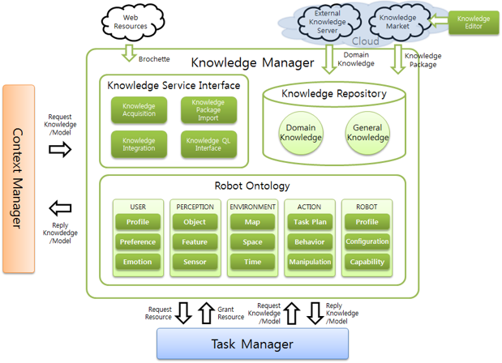

# KnowledgeManager

## 개요
**지식 관리자**(Knowledge Manager, __*KM*__)는 범용적인 지식이 포함되어있는 온톨로지와 더불어 사용자(User), 인지(Perception), 환경(Environment), 행위(Action), 로봇 프로파일(Robot) 등을 포함하는 로봇 서비스에 특화된 온톨로지(Ontology)를 기반으로 지능적인 로봇 서비스 수행에 필요한 지식(Knowledge)을 관리하고 제공하는 모듈이다.

**지식 관리자**는 로봇 서비스 수행에 필요한 단순 지식 정보 제공의 기능뿐만 아니라, 필요에 따라 지식 간 관계 정보(Relation)를 이용하여 새로운 지식을 생성하는 추론(Inference) 기능을 갖추고 있다. 

## 기능
* 지능 로봇 서비스와 관련된 온톨로지의 효율적인 관리.
* 타 모듈에서 요청하는 지식 제공 및 지식 추론을 통한 새로운 지식 생성.

## Knowledge Manager Action

지식 관리자는 기본적으로 온톨로지 데이터에 대한 CRUD operation을 제공하며, 지식 추론을 통한 특별한 기능도 제공한다. 타 Agent로부터의 지식 관리자에게 지식 처리를 요청하는 경우, 지식 관리자가 수행할 수 있는 Action 은 아래와 같다. 

#### 지식 생성 CREATE
|GL protocol|description|
|-|-|
|(createClass $superClass $newClassID)|새로운 클래스 생성|
|(createProperty $propertyType $superProperty $propertyID $domain $range)|새로운 프로퍼티 생성|
|(createIndividual $typeClass $individualID)|새로운 인디비주얼 생성|
|(createRelation $subject (predicate $p $o) (predicate $p $o) ... (predicate $p $o))|새로운 관계 트리플(S - P - O) 생성|

#### 지식 삭제 DELETE
|GL protocol|description|
|-|-|
|(deleteClass $superClass $targetClass)|기존 클래스 삭제|
|(deleteProperty $propertyType $superProperty $propertyID $domain $range)|기존 프로퍼티 삭제|
|(deleteIndividual $typeClass $individualID)|기존 인디비주얼 삭제|
|(deleteRelation $subject $predicate $object)|기존 관계 트리플 삭제|

#### 지식 질의 READ
|GL protocol|description|
|-|-|
|(queryRelation *$s* *$p* *$o* $result)|$s $p $o 중 1개 또는 2개를 채워 질의하면 비어있는 인자에 대한 질의 결과를 $result 에 바인딩하여 반환|
|(queryMultiRelation (tripleSet (triple $s $p $o) (triple $s $p $o) ... ) $result)|join 되어있는 질의 결과를 $result 에 바인딩하여 반환|
|(queryCloudRelation $s $p $o $result)|클라우드 정보에 접근하여 질의 결과 반환|

#### 지식 추론 Inference
|GL protocol|description|
|-|-|
|(requestPath $type (currentPoint $x $y $z) $departure $destination)|현재 좌표로부터 목적지까지의 최단 이동경로|
|(requestRecommendation $userID $targetAction $result)|행위에 따라 사용자에게 적절한 object 추천|

## Ontology list

* isro.owl
* isro_social.owl
* isro_medical.owl
* isro_VS.owl
* isro_SD.owl

