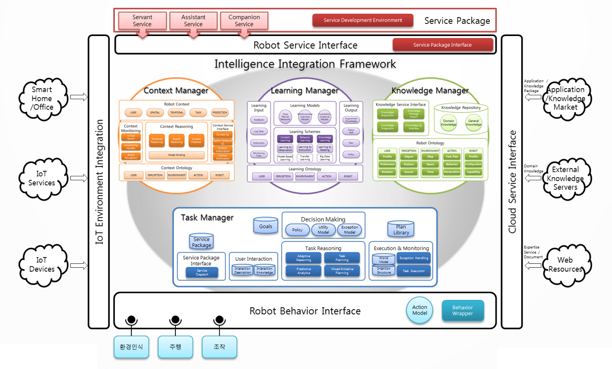

# Introduction
지능형 로봇 플랫폼은 로봇이 서비스를 수행하는 과정에서 필요한 지능적 의사결정을 지원하기 위하여 구축된 시스템이다. 본 시스템은 인식, 사고, 행위 전반에 걸친 종합적 지능적 판단을 지원하기 위하여 구현되었으며, 로봇 하드웨어나 서비스 시나리오에 독립적으로 기능을 제공할 수 있는 개방적 환경 구성을 목표로 구현되었다.
본 시스템은 이러한 목표를 달성하기 위한 다음과 같은 특징을 가진다.

## 1. 모델 기반 아키텍처
본 시스템상의 대부분의 기능은 개발자의 의도에 따라 임의로 작성한 모델에 의하여 구동된다. 로봇의 의사결정 과정, 환경 정보의 인식과 추론 방법, 서비스에 관련된 정보 뿐만 아니라, 로봇 행위 모듈과의 연동, 외부 서비스의 연계와 같은 시스템의 모든 기능은 모두 지식 기반 서술 체계를 통해 구현되어 로봇에 적용될 수 있으며, 시스템은 이를 위한 기반 기술을 지원하여 유연하게 환경과 서비스에 대한 적응할 수 있는 것을 목표로 하였다. 이를 통해 시스템이 로봇의 하드웨어나 시나리오 환경과 관계없이 개발자가 원하는 기능을 추상화된 모델의 개발을 통해 제공할 수 있게 되었다.

## 2. BDI 아키텍처
본 시스템은 지능적 의사결정을 위하여 BDI 아키텍처를 바탕으로 설계되어, 환경 정보를 수집, 추론하여 반응형 작업계획을 수립(Reactive Planning)할 수 있는 구조를 갖추고 있다. 이러한 과정을 지식 정보의 추론을 통해 이루어져 지식모델을 기반으로 통합될 수 있도록 구성되었다. 이를 위해 본 시스템은 서비스 환경에서 필요로 하는 지식을 관리하고 추론하는 지식관리자, 환경정보의 수집과 지식 통합을 지원하는 상황 관리기, 지식과 상황에 대해 작업 계획을 수립하고 실시간으로 의사결정을 수행하는 작업 관리기, 장기적인 서비스 경험을 통해 적응적으로 서비스를 제공할 수 있도록 지원하는 학습 관리기 등의 핵심 기능으로 구성된다.

## 3. 개방형 플랫폼
최근 기술은 다양한 형태의 로봇 하드웨어가 개발되고 있으며, 로봇에 포함될 수 있는 인식, 조작, HRI, 이동 등에 관한 소프트웨어와 하드웨어가 통합된 기능들이 개발되고 있다. 뿐만 아니라 IoT, 클라우드 기술을 통해 다양한 기능과 장치를 쉽게 접근하여 활용할 수 있게 되어 로봇이 가용한 기능 컴포넌트는 지속적으로 다면화되고 확장되고 있는 추세이다. 본 시스템은 하드웨어나 소프트웨어 컴포넌트에 한정되지 않고 유연하게 서비스를 수행할 수 있도록 다양한 개방형 인터페이스를 제공하고 있다. 로봇 하드웨어나 소프트웨어 모듈과 연동하기 위하여 ROS 와 같은 미들웨어와 연계할 수 있는 하향 인터페이스, 외부 Cloud 서비스나 IoT 장치와 연계할 수 있는 가상 장치 관리자나 클라우드 서비스 관리자, 이들을 연계하여 통합된 서비스를 구현할 수 있도록 패키지 기반 서비스 적용을 지원하는 서비스 패키지 dispatcher 등 로봇의 지능이 개방적으로 적용될 수 있는 다양한 인터페이스를 지원하고 있으며, 이는 개발 요구사항에 따라 지속적으로 확장될 수 있도록 하였다.

## 링크
본 시스템의 단위 기능에 대한 세부적인 정보는 다음의 링크를 통해 확인할 수 있다.

* [ARBI 프레임워크(ARBI Framework)](./ARBI/README.md)
* [작업 관리자(Task Manager)](./TaskManager/README.md)
* [상황 관리자(Context Manager)](./ContextManager/README.md)
* [지식 관리자(Knowledge Manager)](./KnowledgeManager/README.md)
* 학습 관리자(Learning Manager)
* [로봇 미들웨어 인터페이스(Behavior Interface)](./InterfaceLayer/README.md)
* [서비스 패키지 디스패쳐(Service Package Dispatcher)](./ServiceDispatcher/README.md)
* [클라우드 서비스 관리자(Cloud Service Manager)](./CloudInterface/README.md)
* [IoT 가상 장치 관리자(Virtual Sensor Manager)](./VirtualSensor/README.md)
* [로봇 모니터링 시스템](./TaskManager/README.md)
* 서비스 개발환경
