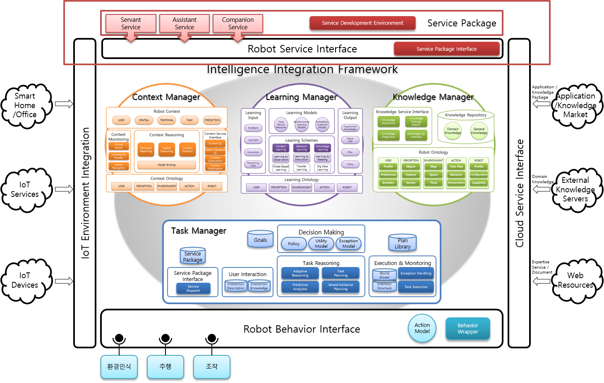
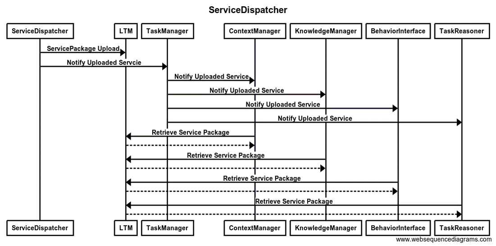

# Service Dispatcher

아키텍쳐 그림 상단의 붉은 사각형이 Service Dispatcher이다.

## 개요
로봇 지능 프레임워크는 변화하는 환경과 사용자의 요구에 대응하여 적합한 행동을 선택할 수 있어야 한다. 이를 달성하기 위해서는 확장성, 개방적인 환경을 위한 기능이 필요한데, 이 기능 중 하나로 제공되는 것이 바로 ServiceDispatcher이다.

ServiceDispatcher는 패키지 형식으로 구성된 서비스에 대한 적용 및 확장을 지원한다. 여기에 사용되는 서비스의 패키지는 지능형 서비스 로봇 플랫폼에서 기본적으로 제공하는 동작 외에 개발자가 직접 제작할 수 있는 서비스의 묶음이다. ServiceDispatcher는 이렇게 개발된 외부 서비스를 로봇 지능 프레임워크에 적용시키는 역할을 하게 된다.

## 기능
ServiceDispatcher는 제작자가 제작한 다양한 서비스 패키지를 읽어 들여 LTM에 업로드한 뒤, 각 모듈이 서비스 패키지를 가지고 갈 수 있도록 알려주는 역할을 한다. 이 과정의 시퀀스 다이어그램은 다음과 같다.

## 모델
Service Dispatcher는 각 TaskReasoner, TaskManager, ContextManager, KnowledgeManager에 들어갈 모델이 필요하다. TaskManager에서는 작업 관리 기능에 사용되는 JAM의 Plan들이 들어가며, ContextManager에서는 상황 추론을 위한 정보들을 Prologue Rule로 서술한 rule 파일들이 들어간다. 또한 Knowledge Manager에는 해당 서비스 패키지에서 사용된 도메인 지식들을 owl로 서술한 Knowledge가 들어간다. TaskReasoner에서는 해당 서비스에 대해 서술되어 있는 ServiceModel이 들어가게 된다.

ServiceModel에는 해당 서비스 패키지의 경로를 서술하는 부분이 존재하며, 이를 통하여 필요한 파일들을 불러올 수 있다.

## 프로토콜
Sender|Type|Receiver|GL|Argument
---|---|---|------|----|
ServiceDispatcher|Request|TaskManager|(InitiateServicePackage $ServiceName)|$serviceName: 특정 서비스 패키지의 이름
TaskReasoner|Request|ServiceDispatcher|(RequestServicePackageInitiation $ServiceName)|$serviceName: 특정 서비스 패키지의 이름

## 이슈
* 서비스 패키지를 Request받아 초기화하는 부분은 아직 완성되지 않았다. 현재는 ServicePackageDispatcher를 초기화하면 해당 에이전트 자체에서 실행시킬 서비스 패키지를 선택하여 초기화한다.
