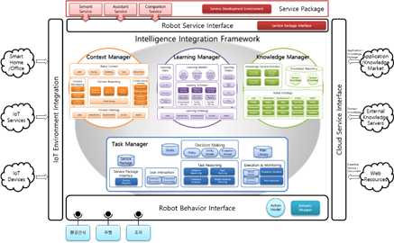

TaskManager
===========



# 개요
로봇 지능 플랫폼은 지능형 서비스 로봇을 제작하기 위한 프로그램이다. 이 플랫폼은 변화하는 환경과 사용자의 요구에 대응하여 적합한 행동을 선택할 수 있는 로봇을 만들기 위해 개발되었으며, TaskManager는 이 지능 로봇 플랫폼의 모듈 중 하나이다.

TaskManager는 로봇이 획득한 현재 상황 정보와 지식을 바탕으로 다음에 어떻게 행동해야 할지 판단한 다음 다른 로봇 모듈에게 필요한 명령을 전달하는 역할을 한다. 이를 위하여 TaskManager는 Planner(?)인 JAM을 탑재하고 있으며, JAM에 입력한 PLAN들 중 다른 모듈들에게서 전달받은 상황 정보와 지식을 통해 가장 적절한 PLAN을 선택해 실행한다.

JAM에 사용되는 PLAN은 TaskManager가 처음 실행될 때 뿐만 아니라 실행될 때 언제라도 더 추가할 수 있다.

# 시스템 요구사항
Hardware : 280MB 이상의 저장 용량

Environment : JRE 1.8 버전

# 설치
## TaskManager 설치
  * [지능체계 깃허브](https://github.com/KIST-vision/ARBI-public/tree/master/TaskManager)에 접속하여 TaskManager 다운로드
  * 다운로드 받은 압축 파일을 압축 해제
## JRE 설치
  * https://java.com/ko/download 에서 JRE 1.8버전 설치

## Broker Configuration 설정
  * 압축 해제된 폴더 안의 configuration/Configuration.xml 파일 설정을 통해 Agent의 정보 입력
    * OS : 실행하는 운영체계 서술 (WINDOW/LINUX) 중 하나 선택
    * ServerURL : 사용하는 메시지 브로커가 동작하고 있는 주소와 포트
    * AgentName : 해당 Agent의 주소로 사용할 이름
    * BrokerType : 사용하는 메시지 브로커의 종류(ZeroMQ/Apollo 중 하나 선택)

### Configuration 예시

```
<?xml version="1.0?>
<Agent-Property>
    <OS>WINDOW</OS>
    <ServerURL>tcp://172.16.165.102:61616</ServerURL>
    <AgentName>TestAgent</AgentName>
    <BrokerType>ZeroMQ</BrokerType>
</Agent-Property>
```

# 실행법
## 윈도우
  1. ArbiFramework 실행(ArbiFramework 문서의 실행 항목 참조)
  2. TaskManager 폴더 내에 위치한 run.bat 파일 실행

## 리눅스
  1. ArbiFramework 실행(ArbiFramework 문서의 실행 항목 참조)
  2. TaskManager 폴더 내에 위치한 run.sh 파일 실행

## 실행 예시
```
C:\> cd TaskManager
C:\TaskManager> run.bat
C:\TaskManager> java –jar TaskManager.jar
TaskManager Executed
=====Start TaskManager Agent=====
JAM definition parse successful.
relation asserted : GLUtility glUtility
relation asserted : Communication communication
.....
```

* 브로커를 찾지 못했을 경우에는 다음과 같이 실행 도중 정지한다.
  ```
    C:\> cd TaskManager
    C:\TaskManager> run.bat

    C:\TaskManager> jav –jar TaskManager.jar
    TaskManager Executed
    =====Start TaskManager Agent=====

  ```

## TaskManager 실행 옵션 목록


|Name|Description|Example|
|----|-----------|-------|
|-broker|브로커의 URL 설정|-broker 127.0.0.1:61616|
|-monitor|JAM 모니터 기능 설정(기본값 false)|-monitor true|
|-configuration|Configuration 파일 경로 지정|-configuration ./config.xml|

## 실행 예시(명령어 포함)

```
C:\> cd TaskManager
C:\TaskManager> run.bat –broker tcp://127.0.0.1:61616 –monitor true

C:\TaskManager> java –jar TaskManager.jar
TaskManager Executed
=====Start TaskManager Agent=====JAM definition parse successful.
relation asserted : GLUtility glUtility
relation asserted : Communication communication
.....
```

# 프로토콜, 명령어 사용법 및 예시

* TaskManager는 Plan을 실행하는 과정에서 다른 Agent들이 수용할 수 있는 프로토콜을 전부 전송할 수 있다. TaskManager가 수용 가능한 프로토콜의 경우 다음과 같다. GL에 대한 명세는 ArbiFramework 문서를 참조

## GL 프로토콜 개요

| GL Name | Type | Description | Argument |
|---------|------|-------------|----------|
|AssertFact|Request|WorldModel에 특정 Relation을 추가|$factName<br>$argument|
|RetractFact|Request|WorldModel에 특정 Relation을 제거|$factName<br>$argument|
|UpdateFact|Request|WorldModel에 특정 Relation을 갱신|$oldFactName<br>$newFactName<br>$newFactArgument|
|Context|LTMSubscription|LTM에서 Context 정보를 받아와 Relation에 추가|$contextName<br>$argument|
|PostGoal|Request|특정 Goal을 Post|$goalName<br>$argument<br>$utility|
|UnpostGoal|Request|특정 Goal을 Unpost|$goalName|
|InitiateServicePackage|Request|서비스 패키지 추가|$servicePackageName|
|LoadPlan|Request|Plan 추가|$fileDirectory|
|UnloadPlan|Request|Plan 제거|$planID|

## 프로토콜 상세 설명
### AssertFact
*  특정 Relation을 TaskManager의 WorldModel에 추가
1. GL 요청 형식
```
(AssertFact ($factName $argument1 $argument2...))
```
  * $factName : 추가할 Relation의 이름
  * $argument : 추가할 Relation의 전달 인자
2. 예시
```
(AssertFact (TestName “argument1”))
Fact Asserted (TestName “argument1”))
```

### RetractFact
* TaskManager의 WorldModel에 존재하는 특정 Relation을 제거
1. GL 요청 형식
```
(RetractFact ($factName $argument1 $argument2...))
```
  * $factName : 제거할 Relation의 이름
  * $argument : 제거할 Relation의 전달 인자
2. 예시
```
(RetractFact (TestName))
Fact Retracted (TestName “argument1”))
```
* 위와 같이 Relation의 이름만 적을 경우, 해당하는 Name을 가진 Relation을 전부 제거한다.
```
(RetractFact (TestName “argument1”))
Fact Retracted (TestName “argument1”))
```

### UpdateFact
* TaskManager의 WorldModel에 존재하는 특정 Relation을 지정한 값으로 갱신
1. GL 요청 형식
```
(UpdateFact 
    ($oldFactName $oldArgument1 $oldArgument2...)
    ($newFactName $newArgument1 $newArgument2...)
)
```
  * $oldFactName : 대체할 Relation의 이름
  * $oldArgument : 대체할 Relation의 전달 인자
  * $newFactName : 새로운 Relation의 이름
  * $newArgument : 새로운 Relation의 전달 인자
2. 예시
```
(UpdateFact (oldFact “argument1”) (TestName “argument2”))
Fact Updated (oldFact “argument1”) -> (TestName “argument2”)
```

### PostGoal
* 특정 Goal을 Post하도록 JAM에 요청
1. GL 요청 형식
```
(PostGoal ($goalName $argument1 $argument2...))
```
  * $goalName : Post할 Goal의 이름
  * $argument : Post할 Goal의 전달 인자
2. 예시
```
(PostGoal (testGoal “goalArgument”))
Goal Posted (testGoal “goalArgument”)
```

### UnpostGoal
* 특정 Goal을 Unpost하도록 JAM에 요청
1. GL 요청 형식
```
(UnpostGoal $goalName)
```
  * $goalName : Unpost할 Goal의 이름
2. 예시
```
(UnpostGoal “testGoal”)
Goal Unposted (testGoal “goalArgument”)
```

### InitiateServicePackage
* 특정 ServicePackage를 LTM에서 불러옴
1. GL 요청 형식
```
(InitiateServicePackage $servicepackageName)
```
  * $servicepackageName : LTM에서 불러올 ServicePackage의 이름
2. 예시
```
(InitiateServicePackage “testPackage”)
retrieving service package start
plan “plan1” retrieval
JAM Parser Version 0.70:
JAM string parse successful.
plan “plan2” retrieval
JAM Parser Version 0.70:
JAM string parse successful.
.....

****ServicePackage Parse Completed****
****Initiated Service : testPackage ****
```

### LoadPlan
* 특정 Plan을 지정된 디렉토리에서 JAM으로 불러옴
1. GL 요청 형식
```
(LoadPlan $directory)
```
  * $directory : Plan이 위치한 디렉토리
2. 예시
```
(loadPlan “./plan/testPlan.jam”)
JAM Parser Version 0.70: C:/TaskManager/testPlan.jam
JAM string parse successful.
```

### UnloadPlan
* 특정 ID를 가진 Plan을 JAM에서 제거
1. GL 요청 형식
```
(removePlan $planID)
```
  * $planID : 제거할 Plan의 ID
2. 예시
```
(removePlan “http://www.arbi.com//TestPlan”)
plan removed : “http://www.arbi.com//TestPlan”
```

# 모델
TaskManager는 내부에 Planning을 하기 위해서 JAM을 사용하고 있다. 따라서 TaskManager에 새로운 Plan을 적용하기 위해선 JAM 언어를 사용하여 작성하여야 한다.

JAM 언어는 다음과 같이 구성되어 있다.

| 이름 | 설명 | 예시 |
|------|-----|------|
|PlanName|해당 Plan의 이름|NAME:"TestPlan"|
|Documentation|해당 Plan에 대한 상세 설명|DOCUMENTATION:”TEST”|
|Attributes|해당 Plan의 전달 인자에 대한 설명|ATTRIBUTES:”$testArg: argument to test”|
|Goal|해당 Plan을 실행시키기 위한 Goal|PLAN ACHIEVE arbi:Test($testArg);|
|Precondition|해당 Plan을 실행시키기 위한 전제조건|PRECONDITION:FACT Test;
|Context|해당 Plan이 유지되기 위한 조건|CONTEXT: FACT TestContext;|
|Body|해당 Plan이 실행되었을 때 동작하는 부분|BODY:PERFORM subgoal();|
|Effects|해당 Plan이 실행되고 난 후 동작하는 부분|EFFECTS:PERFORM subgoal();|
|Failure|해당 Plan이 실행에 실패했을 때 동작하는 부분|FAILURE:PERFORM testErrorHandling();|
|Utility|해당 Plan의 우선도|UTILITY : 10;|

TaskReasoner
=============

TaskReasoner는 상황 정보를 기반으로 Service Model의 workflow에 따라 현재 수행하여야 하는 Goal을 선택하거나, 서비스의 우선도를 결정하기 위한 Policy의 값을 결정하는 메타 추론 과정을 수행한다. 

```
C:\> cd TaskReasoner
C:\TaskReasoner>run.bat
C:\TaskReasoner>java -jar TaskReasoner.jar
JAM definition parse successful.
relation asserted : GLUtility glUtilityJAM Parser Version 0.70:
모델 파일이 존재하지 않아 기본 모델을 작성합니다.
JAM definition parse successful.
relation asserted: GLMessageManager ...
Assert relation : GLMessageManager
....
agentName : agent://www.arbi.com/taskReasoner
brokerType : zeromq
.....
JAM string parse successful.
boot success
Broker Connected : tcp://localhost:61616
reasoner boot complete!
```
브로커 찾지 못했을 때의 경우
```
C:\> cd TaskReasoner
C:\TaskReasoner>run.bat
C:\TaskReasoner>java -jar TaskReasoner.jar
JAM definition parse successful.
relation asserted : GLUtility glUtilityJAM Parser Version 0.70:
모델 파일이 존재하지 않아 기본 모델을 작성합니다.
JAM definition parse successful.
relation asserted: GLMessageManager ...
Assert relation : GLMessageManager
....
agentName : agent://www.arbi.com/taskReasoner
brokerType : zeromq
.....
JAM string parse successful.
boot success
Broker Connected : tcp://localhost:61616
```

브로커를 찾지 못하였을 경우에는 위의 상태에서 멈추게 된다. 

## 프로토콜

TaskReasoner는 다음과 같은 메시지를 수용할 수 있다.

|GLName|Type|Description|Argument|
|------|----|------------|-------|
|ServiceModel|Send|ServiceModel을 받아 해당 서비스를 실행하는 Plan으로 변환하여 JAM에 추가|$serviceID<br>$serviceName<br>$workflow<br>$precondition|
|Policy|Send|Policy를 받아 Policy 값을 계산하는 Plan으로 변환하여 JAM에 추가|$policyName<br>$serviceName<br>$arguments<br>$evaluation|
|Goal|LTMSubscription|LTM에서 Goal 정보를 받아와 JAM에 해당 Goal을 추가|$goalName<br>$precondition<br>$postcondition|
|Context|LTMSubscription|LTM에서 Context 정보를 받아와 Relation에 추가|$contextName$argument|

* ServiceModel : Service Model을 받아 workflow의 goal을 순서대로 수행하는 Plan을 생성하여 JAM에 추가함
  1. GL 수신 형식: (serviceModel $serviceID $serviceName (workflow $goalName $goalName ...) (precondition ($contextName $arg ...) ...)))
      - $serviceID : 서비스의 ID
      - $serviceName : 서비스의 이름
      - $goalName : workflow에 명시된 Goal의 이름
      - $contextName : Context의 이름	
      - $arg : Context의 인자
  1. 예시: (serviceModel “id” “test” (workflow “goal1” “goal2” “goal3”) (precondition (exampleContext “arg1” “arg2”)))
      ```
      (PostGoal (testGoal “goalArgument”))
      Goal Posted (testGoal “goalArgument”)
      ```
* Policy : Policy 정보를 받아 해당 Policy 값을 계산하는 Plan을 생성하여 JAM에 추가함
   1. GL 수신 형식 : (policy ($policyName $serviceName $evaluation) (contextList (context $arg ...) ...))
      - $policyName : policy의 이름
	   - $serviceName : 현재 policy가 소속된 서비스의 이름
	   - $evaluation : policy의 값 결정 방법
   1. 예시 : (policy (examplePolicy “test” “if($bool == ture){$value = 100;} else {$value = 10;}” (contextList (cont1 $v1) (cont2 $bool $v2))))
      ```
      (PostGoal (testGoal “goalArgument”))
      Goal Posted (testGoal “goalArgument”)
      ```