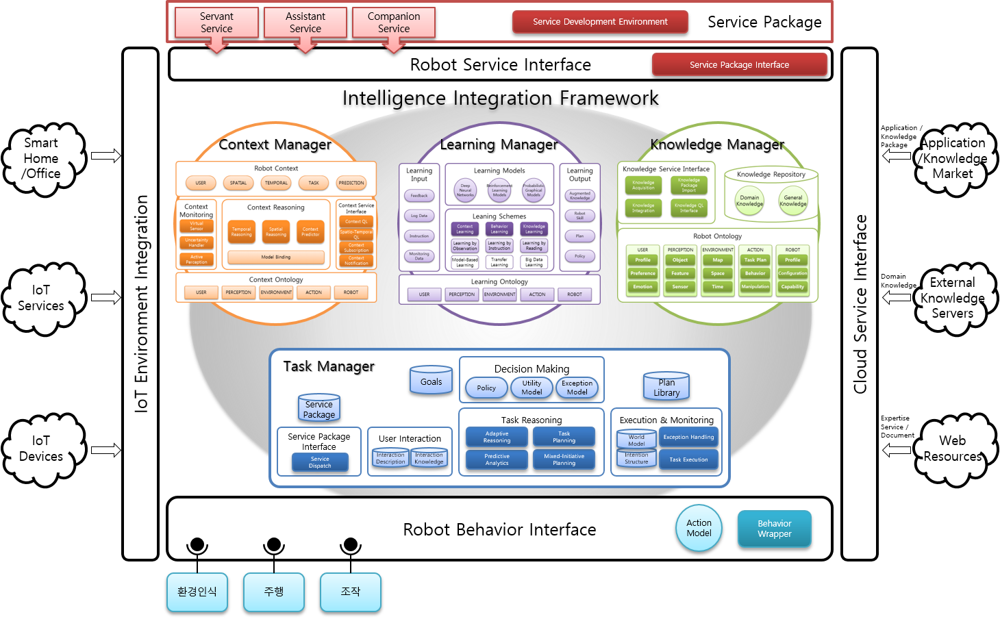

# TaskManager

아키텍처 하단의 푸른 사각형이 TaskManager이다.

## 개요
로봇 지능 프레임워크는 변화하는 환경과 사용자의 요구에 대응하여 적합한 행동을 선택할 수 있어야 한다. 이 때 변화하는 환경을 관측하고 이에 따라서 최선의 선택을 내리는 모듈이 바로 TaskManager이다.

TaskManager는 JAM으로 작성된 플랜들을 사용하여 동작한다. ContextManager, KnowledgeManager로부터 수집한 정보들을 바탕으로 현재 상황에 가장 적합한 Plan들을 선택하여  ,BehaviorInterface, CloudInterface,IOT Interface 등에 다음에 어떤 행동을 수행해야 할지 전달한다.
## 기능
TaskManager는 TaskReasoner에게서 받은 Goal을 수행하기 위해 현재 가지고 있는 Plan들과 현재 Context들을 조합하여 최적의 행동이 무엇인지 선택하게 된다. 이 과정의 시퀀스 다이어그램은 다음과 같다.

## 모델
TaskManager는 내부에 Planning을 하기 위해서 JAM을 사용하고 있다. 따라서 TaskManager에 새로운 Plan을 적용시키기 위해선 JAM 언어를 사용하여 작성하여야 한다.

JAM 언어는 다음과 같이 구성되어 있다.

이름 | 설명 | 예시
---|-----|------
PlanName | 해당 Plan의 이름 | NAME:"TestPlan"
Documentation | 해당 Plan에 대한 상세 설명 | DOCUMENTATION:”TEST”
Attributes |해당 Plan의 전달 인자에 대한 설명 | ATTRIBUTES:”$testArg: argument to test”
Goal | 해당 Plan을 실행시키기 위한 Goal | PLAN ACHIEVE arbi:Test($testArg);
Precondition | 해당 Plan을 실행시키기 위한 전제조건 | PRECONDITION: FACT Test;
Context | 해당 Plan이 유지되기 위한 조건 | CONTEXT:  FACT TestContext;
Body | 해당 Plan이 실행되었을 때 동작하는 부분 | BODY: PERFORM subgoal();
Effects | 해당 Plan이 실행되고 난 후 동작하는 부분 | EFFECTS: PERFORM subgoal();
Failure | 해당 Plan이 실행에 실패했을 때 동작하는 부분 | FAILURE: PERFORM testErrorHandling();
Utility | 해당 Plan의 우선도 | UTILITY : 10;

## 프로토콜
TaskManager는 Plan을 실행하는 과정에서 다른 Agent들이 수용할 수 있는 프로토콜을 전부 전송할 수 있다. TaskManager가 수용 가능한 프로토콜의 경우 다음과 같다.

Sender|Type|Description|Receiver|GL|Argument
---|---|---|---|---|---
Agent|Request|해당되는 이름의 TopLevelGoal을 실행|TaskManager|(postGoal ($goalName $arg) $utility)|$goalName: 실행시킬 Goal의 이름 $arg : Goal의 전달인자 $utility : Goal의 우선도
Agent|Request|해당되는 이름의 TopLevelGoal을 제거|TaskManager|(unpostGoal $goalName) |$ goalName: 제거할 Goal의 이름
Agent|Request|전달된 Fact를 등록|TaskManager|(assertFact ($factName $factArg))|$factName : 등록할 Fact의 이름 $arg : fact의 전달인자
Agent|Request|전달된 Fact를 제거|TaskManager|(retractFact $factName)|$factName : 제거할 Fact의 이름
Agent|Request|서비스 패키지를 초기화|TaskManager|(IniateServicePackage $ServicePackageName)|$ServicePackageName : 실행시킬 ServicePackage의 이름
