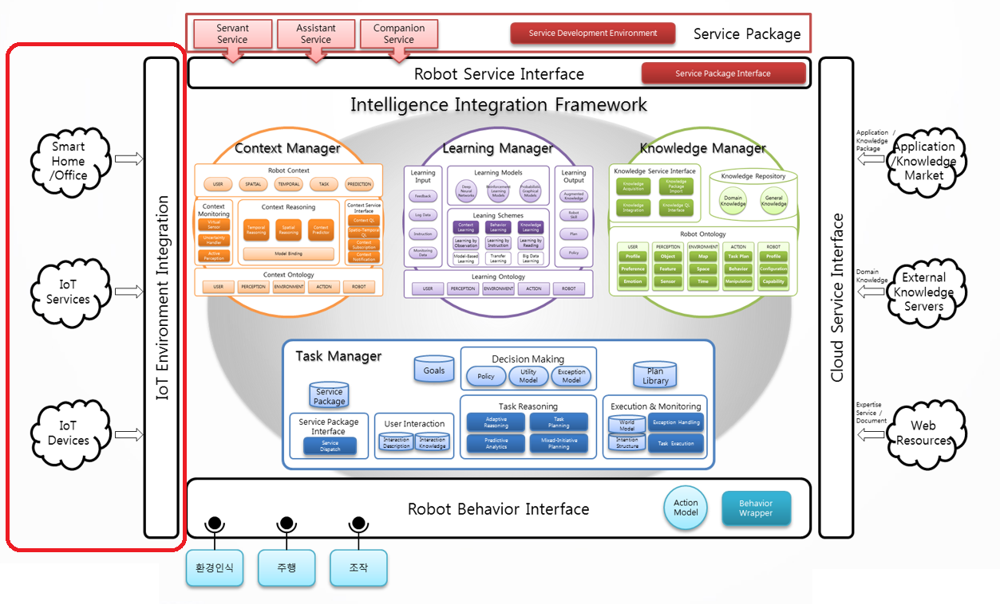
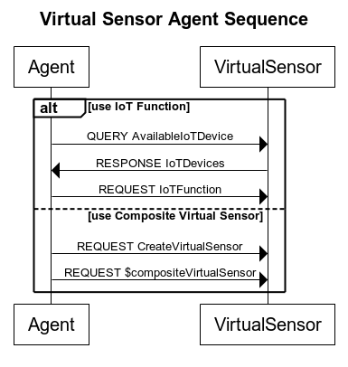

# Virtual Sensor Agent

아키텍쳐 도식 중 좌측의 붉은 사각형(IoT Environment Intergration)이 Virtual Sensor Agent이다.

## 개요
Virtual Sensor는 지능체계가 외부의 IoT 기기의 서비스를 활용할 수 있도록 인터페이스 역할을 수행하는 에이전트다.

지능체계 내의 타 에이전트가 IoT 기기를 활용한 서비스를 사용해야 할 때 Virtual Sensor Agent는 서비스 내에 서술된 IoT 환경으로부터 사용 가능한 서비스를 발견(discovery)하여 지식 기반으로 추상화해 Virtual Sensor Model을 생성하여 관리한다. Model을 바탕으로 Virtual Sensor Agent는 IoT 기능을 사용하고자 하는 에이전트에게 기능 목록을 전달할 수 있으며, 에이전트는 전달받은 기능 중 필요한 기능을 수행할 수 있다. IoT 기기를 사용하기 위해 필요한 통신 절차나 인증 절차 등은 Virtual Sensor Agent가 대행해주며, 타 에이전트는 ARBI Framework의 Agent Protocol에 맞게 IoT 서비스를 실행시킬 수 있다.

또한, 복수의 IoT 기능을 지식화하여 보다 추상적인 기능으로 가공한 Composite Virtual Sensor를 작성할 수 있다. 작성된 Composite Virtual Sensor는 타 에이전트에서 Virtual Sensor Model의 기능을 사용하듯이 Agent 프로토콜을 사용해 쉽게 접근할 수 있다.

## 기능
Virtual Sensor Agent는 다른 에이전트의 요청에 따라 외부 IoT 서비스를 수행한다.

Virtual Sensor Agent를 사용한 외부 IoT 서비스 사용 sequence diagram은 다음과 같다.

## 모델
_주의 : Virtual Sensor Agent는 현재 OM2M Framework 환경 내에서만 동작 가능하다._

Virtual Sensor Agent는 지능체계와 연동할 IoT Framework에 대한 모델이 필요하다. IoT Framework에 대한 모델은 다음과 같이 정의된다.

문서 내에 사용된 "MUST", "MUST NOT", "REQUIRED", "SHALL", "SHALL NOT", "SHOULD", "SHOULD NOT", "RECOMMENDED", "OPTIONAL", "OPTIONAL" 키워드는 [RFC 2119](https://www.ietf.org/rfc/rfc2119.txt)에 설명된 대로 해석되어야 한다.

### IoT Framework Model

|이름|타입|설명|형식|예시|Requirement Level|
|----|----|-------|---|----|--|
|Service URL|URL|IoT Framework URL|URL|"http://172.16.165.50:8282"|REQUIRED|
|Framework Type|String|IoT 프레임워크 타입|일반 String|"OM2M"|REQUIRED|

#### Device Metadata

지능체계에서 연계 대상이 되는 IoT Device는 일정 양식의 Metadata를 Label에 포함하여야 한다. Label에 포함되야 하는 데이터는 다음과 같이 정의된다.

|이름|타입|설명|형식|예시|Requirement Level|
|----|----|-------|---|----|--|
|Category|String|IoT 기기의 Type|String|"lighting", "air_conditioner"|REQUIRED|
|Location|String|IoT 기기의 위치|String|"office001","office002"|REQUIRED|

#### Functionality

기기의 Metadata로부터 기기의 Service를 Mapping하기 위해 필요한 Functionality Model이다. Functionality Model은 IoT 기기가 가진 리소스의 세부 주소를 포함하여 Virtual Sensor Agent가 IoT 기능을 실행할 수 있도록 한다.

|이름|타입|설명|형식|예시|Requirement Level
|----|----|----|----|----|---|
|Category|String|Mapping할 기기의 Category|일반 String|lighting|REQUIRED|
|Functions|list<Function>|Category가 포함할 기기의 Function List|List||REQUIRED|

Function의 정의는 다음과 같다.

|이름|타입|설명|형식|예시|Requirement Level
|----|----|----|----|----|---|
|Function Name|String|Function의 이름|일반 String|setOn|REQUIRED|
|ResourceURL|URL|Function을 사용하기 위한 세부 URL 주소|String|?op=setOn&lampid=$ID|REQUIRED|
|Method|HTTP Method|Function을 사용할 때 URL 주소로 접근할 HTTP Method의 타입|HTTP Method|POST,GET,DELETE,PUT|REQUIRED|

## 프로토콜

_기울임꼴_ 글자체는 선택사항을 의미한다.

__굵은___ 글자체는 반복 가능한 것을 의미한다.

| # | Sender 	| 타입 	| Receiver 	| GL 	| Argument 	|
|---|----------------	|----------	|------------------	|----------------------------------------------------------------------------------------------------------------------------------------------------------------------------------------------------------	|-------------------------------------------------------------------------------------------------------------------------------------------------------------------------------------------------------------------------------------------------	|
| 1 | Agent | Query | VirtualSensorAgent 	| (AvailableIoTDevice _(Location $location)_) 	| $location : 검색을 수행할 Location|
| 2 | VirtualSensorAgent | Response(#1) | Agent | (IoTDevices 　( __IoTDevice__  　　(Type $type) 　　(Name $name) 　　(URL $url) 　　(Functionality __$functions__) 　) ) 	| $type : 장치의 타입 $name : 장치의 이름 $url : 장치 URL __$functions__ : 장치가 사용할 수 있는 기능. 예시 : "getState","switchOFF","switchON" |
| 3 | Agent | Request | VirtualSensorAgent 	| (IoTFunction $name $function) 	| $name : 사용할 대상 기기의 이름. $function : 사용할 대상 기능 |
| 4 | VirtualSensorAgent | Response(#3) | Agent | (IoTResponse _$response_ ) 	| $response : 반환값. 기능 사용 결과로 반환되는 값이 존재할 경우 사용된다. |
| 5 | Agent | Request | VirtualSensorAgent 	|  (CreateVirtualSensor 　(Name $name) 　(Location $location) 　(__IoTFunction__ $deviceName $deviceFunction) ) 	| $deviceName : 기기의 이름  $deviceFunction : 사용할 기능 |
| 6 | Agent | Request | VirtualSensorAgent | ($compositeVirtualSensor) | $compositeVirtualSensor : 실행할 생성되어 있는 Composite Virtual Sensor의 이름. #5의 $name에 해당됨 |

## 이슈

 * 현 버전에서는 OM2M 프레임워크만을 지원한다.
