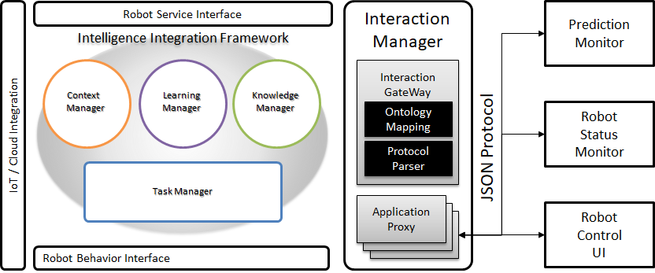

# Web Monitor

## 개요
Web Monitor는 ARBI Framework의 Logger Manager와 연동하는 외부 웹 모니터 서비스이다.

지능체계 내의 에이전트가 서비스를 실행할 때 생성되는 다양한 로그를 수집하여 분석과 가공 과정을 거친 후 개발자가 쉽게 이해할 수 있는 형태로 시각화하여 웹 사이트의 형태로 보여준다.

## 기능
Web Monitor는 ARBI Framework의 Logger Manager와 통신하여 프레임워크 내의 핵심 에이전트들의 로그를 필요에 따라 취사선택하여 수집, 가공, 시각화할 수 있다.

## 모델
Web Monitor가 수집할 수 있는 로그는 다음과 같다.

문서 내에 사용된 "MUST", "MUST NOT", "REQUIRED", "SHALL", "SHALL NOT", "SHOULD", "SHOULD NOT", "RECOMMENDED", "OPTIONAL", "OPTIONAL" 키워드는 [RFC 2119](https://www.ietf.org/rfc/rfc2119.txt)에 설명된 대로 해석되어야 한다.

|Agent|Type|Action|Content|
|----|----|----|-------|
|TaskManager|WorldModel|Assert|String|
|TaskManager|WorldModel|Retract|String|
|TaskManager|Goal|New|String|
|TaskManager|Goal|Unpost|String|
|ContextManager|WorkingMemory|context| json |
|ContextManager|WorkingMemory|availableMemory| json |
|ContextManager|ContextService|query| json |
|ContextManager|ContextService|notify| json |
|ContextManager|ContextService|subscribe| json |
|ContextManager|Counting|monitor| number |
|ContextManager|Counting|perception| number |
|ContextManager|Counting|triple| number |
|ContextManager|RobotContext|availableBattery| json |
|ContextManager|RobotContext|LatestPerception| json |
|KnowledgeManager|UPDATEOWL|updateOWL| OWL string |
|KnowledgeManager|INFERENCE|parseSentence| json |
|KnowledgeManager|INFERENCE|pathFind| json List |
|KnowledgeManager|INFERENCE|conversationContent| json |
|KnowledgeManager|KNOWLEDGEGT|insertSchedule| json |
|KnowledgeManager|QueryType|QueryProperty| json |
|ServiceDispatcher|Rule|Load| swipl file |
|ServiceDispatcher|Plan|Load| JAM file |
|ServiceDispatcher|Knowledge|Load| OWL file |
|ServiceDispatcher|Robot|Load| robot behavior file |

## 이슈

 * 현 버전에서는 로그를 받아오는 기능만이 존재한다. 추후 모니터 서비스에서 프레임워크로 메세지를 보낼 수 있도록 수정 예정이다.
